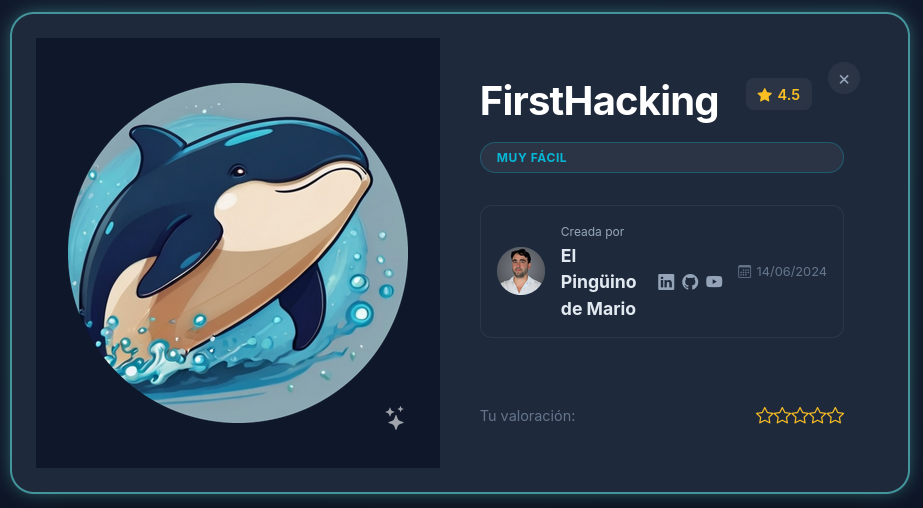
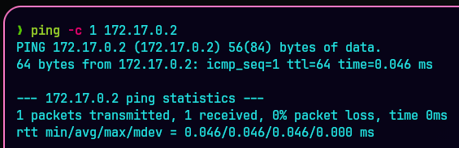
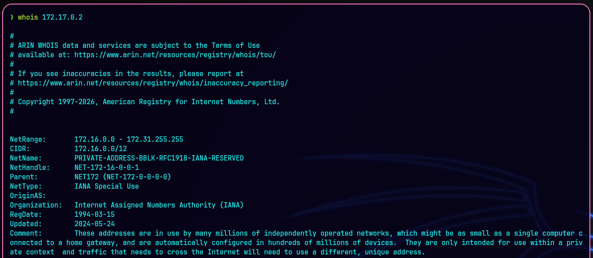
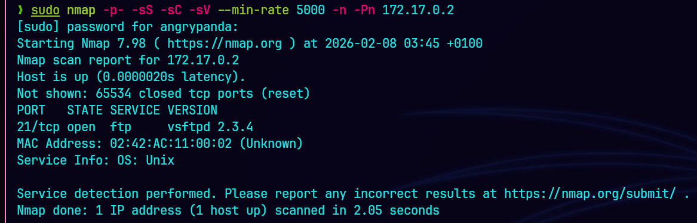
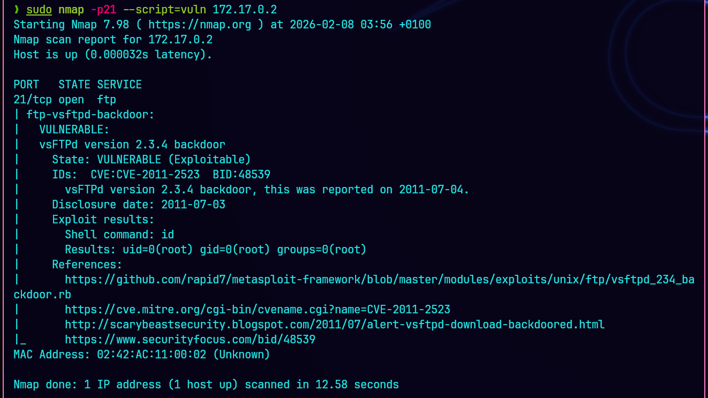
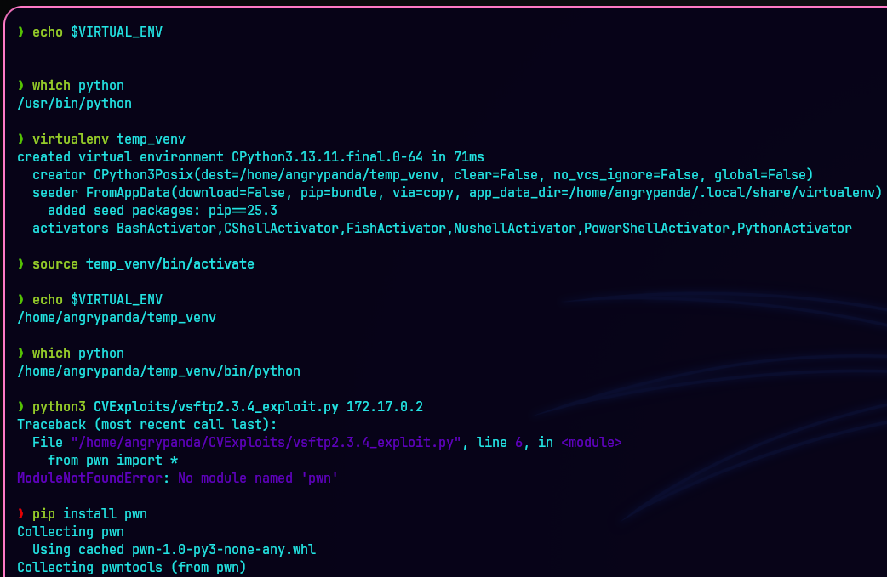
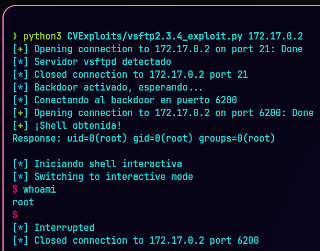
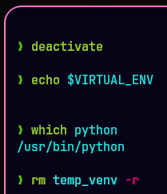

# 🧪 WriteUp - FirstHacking - (DockerLabs 🐋)



---
## 🎯 Planificación y Alcance

| Componente          | Detalle                                           |
| ------------------- | ------------------------------------------------- |
| MV Atacante         | Kali Linux (VirtualBox)                           |
| MV Objetivo         | FirstHacking (DockerLabs)                         |
| Modo de Red         | Adaptador Puente                                  |
| Herramientas Usadas | `ping`, `nmap`, `virtualenv`, `python3`, `whoami` |

---
## 🔍 Reconocimiento

Lo primero de todo, vamos a realizar una comprobación `ICMP` para verificar la conectividad, latencia y accesibilidad del host:
`ping -c 1 172.17.0.2`



Podemos ver que tenemos conectividad con la máquina víctima y que se trata de un sistema Unix, `ttl=64`

Vemos un poco más de información acerca de la `IP` con el comando `WHOIS`:



Se trata de una máquina con `IP privada`, alojada dentro de nuestra red interna. 

---
## 📡Escaneo y Análisis de Vulnerabilidades

Efectuamos un escaneo con `Nmap` para realizar un primer reconocimiento de la máquina víctima:
`sudo nmap -p- -sS -sC -sV --min-rate 5000 -n -Pn -vvv 172.17.0.2`



Vemos que tiene el puerto `21` `FTP` abierto, con una versión desactualizada `vsftpd 2.3.4` y verificamos que se trata de un `SO Unix`.

📖 **Parámetros:**
```bash
-p-: Escaneo completo de todos los puertos, del 1 al 65535.
-sS: Stealth Scan, realiza un escaneo TCP SYN.
-sC: Uso de los scripts predeterminados del NSE (Nmap Scripting Engine).
-sV: Activa la detección de versiones.
--min-rate 5000: Mantiene una velocidad de envío de paquetes de al menos 5000 paquetes por segundo. Hace mucho ruido.
-n: Desactiva la resolución DNS inversa sobre las direcciones IP activas encontradas.
-Pn: Omite la etapa de descubrimiento de hosts (ping) y asume que el objetivo está encendido.
-vvv: Triple verbose. Información en tiempo real del escaneo.
```

Vamos a realizar un escaneo de vulnerabilidades del puerto `21`:
`sudo nmap -p21 --script=vuln 172.17.0.2`



📖 **Parámetros:**
```bash
-p21: Asignación del escaneo al puerto especificado 21.
--script=vuln: Activación de una categoría específica del NSE para detectar vulnerabilidades conocidas en los servicios que se encuentran abiertos.
```

Encontramos una vulnerabilidad `ftp-vsftpd-backdoor` de la versión `vsftpd 2.3.4` con un `CVE-2011-2523`:


[^1]

---
## ⚔ Explotación

En este caso usaremos un exploit manual para realizar la intrusión a la máquina víctima. Buscando en Internet encontramos el código a emplear:
https://github.com/Maalfer/vsftpd-2.3.4-exploit/tree/main
Copiamos el código y lo pegamos en el script que usaremos:
`nano path_script/script.py`

Para esto, primero debemos crear un `entorno virtual` para que no haya conflictos a la hora de usar Python con las dependencias necesarias para su posterior ejecución:

```bash
virtualenv temp_venv # Creación del entorno virtual, (python3 -m venv temp_venv).
source temp_venv/bin/activate # Activación del entorno virtual.
echo $VIRTUAL_ENV # Comprobación del entorno virtual activo. Si está activo muestra su ruta, de lo contrario, no muestra nada.
# EJECUCIÓN DEL CÓDIGO:
which python # Comprobación del entorno virtual activo. Si está activo muestra la ruta del entorno virtual, de lo contrario, muestra la ruta original.
python3 path_script/script.py 172.17.0.2 # Si necesita alguna dependencia nos saltará el aviso para instalarla.
pip install dependencia # Instalación de la dependencia.
```



Una vez instaladas las dependencias necesarias, lanzamos de nuevo el script:
`python3 path_script/script.py`



Vemos como realizamos la intrusión a la `Shell` de la máquina víctima con éxito.
Con el comando `whoami` podemos comprobar que hemos accedido como `root`.
Para salir de la conexión: `CTRL+c`.

Para finalizar el entorno virtual una vez realizada la intrusión:

```bash
deactivate # Desactivación del entorno virtual.
echo $VIRTUAL_ENV # Comprobación del entorno virtual desactivado.
which python # Comprobación del entorno virtual desactivado.
# Una vez desactivado el entorno, se puede eliminar:
rm temp_env -r
```



---
## 💥 Post-Explotación

En este caso, una vez realizada la intrusión ya se accede con los privilegios de `root` por lo que la intrusión y el control es total, sin necesidad de realizar ninguna escalada de privilegios ni movimientos laterales.

---
## 🧾 Informe Final

**1. DESCRIPCIÓN DEL PROBLEMA**  

CVE-2011-2523 corresponde a un **backdoor intencional** insertado en el código fuente de `vsftpd 2.3.4` durante un período específico de 4 días [^2]. Al recibir un usuario que contenga el carácter `":)"`, el servicio abre una `shell root` en el puerto `6200/TCP` sin requerir autenticación. Clasificación CWE-78 (Command Injection) [^3].

**2. SISTEMAS AFECTADOS**

- vsftpd 2.3.4 descargado entre 2011-06-30 y 2011-07-03 [^2].
- Distribuciones que incluyeron dicho binario: Debian 8, 9, 10 (versiones específicas) [^4].
- **NO afecta**: Red Hat Enterprise Linux 3-6 ni versiones posteriores a 2.3.4.

**3. ESTRATEGIAS DE SOLUCIÓN (POR ORDEN DE PRIORIDAD)**

**3.1. ACTUALIZACIÓN DEL SOFTWARE (SOLUCIÓN DEFINITIVA)**

- **Acción inmediata**: Actualizar vsftpd a versión superior a 2.3.4 (recomendado 3.0.3 o posterior [^4].
- **Comando Debian/Ubuntu**: `apt-get update && apt-get install vsftpd`
- **Compilación manual**: Descargar fuente desde repositorio oficial.
- **Verificación**: Confirmar versión con `vsftpd -v` (debe mostrar ≠ 2.3.4).

**3.2. MEDIDAS COMPENSATORIAS (SI NO SE PUEDE ACTUALIZAR)**

- **Bloqueo en red**: Restringir acceso al puerto 21/TCP solo a IP confiables mediante firewall.
- **IPS/IDS**: Implementar reglas específicas. Check Point y otros fabricantes proveen firmas para bloquear intentos de explotación [^5].
- **Deshabilitar servicio**: Si FTP no es crítico, detener servicio (`systemctl stop vsftpd`).

**3.3. VERIFICACIÓN DE COMPROMISO**  

Si el sistema ha ejecutado versiones vulnerables, **debe asumirse como comprometido**.
Acciones requeridas:

- Análisis forense para determinar actividad maliciosa.
- Rotación de todas las credenciales almacenadas en el sistema.
- Reinstalación completa del sistema operativo si hay evidencia de acceso no autorizado.

**4. PROCEDIMIENTO DE VERIFICACIÓN DE REMEDIACIÓN**

1. Comprobar versión instalada: `dpkg -l | grep vsftpd` o `rpm -qa | grep vsftpd`.
2. Escanear puertos localmente: `netstat -tlnp | grep 6200` (no debe haber servicio escuchando).
3. Prueba de explotación controlada (solo entornos aislados): intentar conexión telnet al puerto 21 con usuario `"test:)"` y posterior conexión a puerto `6200`.

**5. RECOMENDACIONES ADICIONALES**

- Suscribirse a alertas de seguridad del proveedor [^2].
- Establecer política de actualizaciones críticas en ≤ 48 horas.
- Segmentación de redes: servidores FTP en zona DMZ con acceso restringido.

---
## 📖 REFERENCIAS

[^1]: https://www.incibe.es/en/incibe-cert/early-warning/vulnerabilities/cve-2011-2523

[^2]: https://www.cve.org/CVERecord?id=CVE-2011-2523

[^3]: https://www.cybersecurity-help.cz/vdb/SB2019112725

[^4]: https://www.twingate.com/blog/tips/cve-2011-2523

[^5]: https://advisories.checkpoint.com/defense/advisories/public/2015/cpai-2015-0458.html
